Airplane Modal Test
===================

This page contains an example demonstrating some usages of SDynPy.  In this
analysis, we will walk through the entirety of the typical analysis/test/analysis
workflow.  We will:

1. Load in the finite element model and use it to select instrumentation
   locations.
2. Simulate a modal test on the test article to collect time data
3. Compute FRFs from the excitation response
4. Fit modes to the frf data
5. Compare modal fits to finite element model
6. Perform finite element expansion using SEREP
7. Create quicklook reports for the test

.. contents::

Imports
-------

For this project, we will import the following modules, including the SDynPy
module.

.. code-block:: python

    import numpy as np # Used for numeric calculations
    import matplotlib.pyplot as plt # For 2d plotting
    import sdynpy as sdpy # Used for structural dynamics features
    
    plt.close('all') # close all plots
    
Default Plotting Options
------------------------

Since we will be plotting a lot of shapes, we will set up some options to use
for all geometry plots.
See the documentation for
:py:func:`sdpy.Geometry.plot<sdynpy.core.sdynpy_geometry.Geometry.plot>`
for these options.  We will create a dictionary of these options so they can
be passed into the various plotting functions using the ``**kwargs`` syntax,
or into the various plotting functions that accept a ``plot_kwargs`` argument.

.. code-block:: python

    plot_options = {'node_size':0,'line_width':1,'show_edges':False,
                    'view_up':[0,1,0]}

Load the Finite Element Model
-----------------------------

For complex modal tests, it can be non-trival to select a good set of sensors.
Additionally, for test articles with internal geometry, sensor locations may
not be accessible once the unit is built up.  Therefore, selecting a good
initial sensor set can be crucial to the success of a given test.  For this
reason, many tests begin by using a finite element model to select a set of
degrees of freedom.  We will follow this path in this example.

Many analyses performed at Sandia National Laboratories use the
`Exodus <https://www.osti.gov/servlets/purl/10102115>`_ file format to store
output data.  We can load in an Exodus file into SDynPy using the
:py:class:`sdpy.Exodus<sdynpy.fem.sdynpy_exodus.Exodus>` class.  Additionally,
we can reduce the size of the finite element model by reducing it to just the
outer surfaces using
:py:func:`sdpy.Exodus.reduce_to_surfaces<sdynpy.fem.sdynpy_exodus.Exodus.reduce_to_surfaces>`,
which returns a
:py:class:`sdpy.ExodusInMemory<sdynpy.fem.sdynpy_exodus.ExodusInMemory>`
object.  This is a resonable step to take, as we will not be able to put any
sensors on the interior of material volumes.

.. code-block:: python

    # Define the filename of our finite element model
    filename = 'airplane-out.exo'
    
    # Load the finite element model and reduce it to just exterior surfaces
    exo = sdpy.Exodus(filename)
    fexo = exo.reduce_to_surfaces()
    
Convert Finite Element Model to SDynPy Objects
----------------------------------------------

At this point, we would like to convert our finite element model into SDynPy
objects to make it easier to work with.  We will create both a
:py:class:`Geometry<sdynpy.core.sdynpy_geometry.Geometry>` as well as
:py:class:`Shapes<sdynpy.core.sdynpy_shape.ShapeArray>`.

Creating a Geometry from an Exodus file
~~~~~~~~~~~~~~~~~~~~~~~~~~~~~~~~~~~~~~~

Our goal is to create a test geometry.  We will note that, while finite element
models are often defined exclusively in a single, global coordinate system,
we often cannot place sensors in the global coordinate system if, for example,
there are surfaces oblique to the principal directions of the part.  We often
place sensors directly on the surfaces, so the sensor coordinate system will
generally be oriented such that it is aligned with the local surface normal of
the location that the sensor is placed.

We will therefore create local coordinate systems to use for sensor selection.
To do this, we use the ``local=True`` argument in the 
:py:func:`sdpy.geometry.from_exodus<sdynpy.core.sdynpy_geometry.from_exodus>`
function.  We will specify a preferred direction in the nose-wise direction
``preferred_local_orientation=[0,0,1]``.
The secondary preferred direction will be "up" 
``secondary_preferred_local_orientation=[0,1,0]``.

.. code-block:: python

    geometry = sdpy.geometry.from_exodus(fexo,local=True,
                                         preferred_local_orientation=[0,0,1],
                                         secondary_preferred_local_orientation=[0,1,0])

Exploring the Geometry object
~~~~~~~~~~~~~~~~~~~~~~~~~~~~~                                         
Take a moment here to explore the 
:py:class:`Geometry<sdynpy.core.sdynpy_geometry.Geometry>` object.  If we
simply type ``geometry`` into the IPython console after running the previous
command, we get out the representation of the
:py:class:`Geometry<sdynpy.core.sdynpy_geometry.Geometry>` object (truncated
here to save space)

.. code-block:: console

    In [1]: geometry
    Out[1]: 
    Node
       Index,     ID,        X,        Y,        Z, DefCS, DisCS
        (0,),      1,    0.496,   -0.062,   -7.000, 20497,     1
        (1,),      2,    0.500,    0.000,   -7.000, 20497,     2
        (2,),      3,   -0.496,   -0.062,   -7.000, 20497,     3
        (3,),      4,    0.429,   -0.256,   -7.000, 20497,     4
        (4,),      5,    0.290,   -0.407,   -7.000, 20497,     5
        (5,),      6,    0.103,   -0.489,   -7.000, 20497,     6
        (6,),      7,   -0.103,   -0.489,   -7.000, 20497,     7
        (7,),      8,   -0.290,   -0.407,   -7.000, 20497,     8
        (8,),      9,   -0.429,   -0.256,   -7.000, 20497,     9
        (9,),     10,   -0.496,    0.063,   -7.000, 20497,    10
      .
      .
      .
    
    Coordinate_system
       Index,     ID,                 Name, Color,       Type
        (0,),      1,          Node 1 Disp,     1,  Cartesian
        (1,),      2,          Node 2 Disp,     1,  Cartesian
        (2,),      3,          Node 3 Disp,     1,  Cartesian
        (3,),      4,          Node 4 Disp,     1,  Cartesian
        (4,),      5,          Node 5 Disp,     1,  Cartesian
        (5,),      6,          Node 6 Disp,     1,  Cartesian
        (6,),      7,          Node 7 Disp,     1,  Cartesian
        (7,),      8,          Node 8 Disp,     1,  Cartesian
        (8,),      9,          Node 9 Disp,     1,  Cartesian
        (9,),     10,         Node 10 Disp,     1,  Cartesian
      .
      .
      .
    
    Traceline
       Index,     ID,          Description, Color, # Nodes
    ----------- Empty -------------
    
    Element
       Index,     ID, Type, Color, # Nodes
        (0,),      1,   64,     1,       4
        (1,),      2,   64,     1,       4
        (2,),      3,   64,     1,       4
        (3,),      4,   64,     1,       4
        (4,),      5,   64,     1,       4
        (5,),      6,   64,     1,       4
        (6,),      7,   64,     1,       4
        (7,),      8,   64,     1,       4
        (8,),      9,   64,     1,       4
        (9,),     10,   64,     1,       4
      .
      .
      .
      
We see there are a large number of
:py:class:`nodes<sdynpy.core.sdynpy_geometry.NodeArray>`,
:py:class:`coordinate systems<sdynpy.core.sdynpy_geometry.CoordinateSystemArray>`,
and :py:class:`elements<sdynpy.core.sdynpy_geometry.ElementArray>`, but no
:py:class:`tracelines<sdynpy.core.sdynpy_geometry.TracelineArray>`.
We can access these data by accessing the
:py:class:`Geometry<sdynpy.core.sdynpy_geometry.Geometry>` attributes:
``geometry.node``, ``geometry.coordinate_system``, ``geometry.element``, and
``geometry.traceline``.

Nodes
^^^^^

We will start with the :py:class:`NodeArray<sdynpy.core.sdynpy_geometry.NodeArray>`
object revealed by ``geometry.node``.  The
:py:class:`NodeArray<sdynpy.core.sdynpy_geometry.NodeArray>` class is a subclass of
:py:class:`SdynpyArray<sdynpy.core.sdynpy_array.SdynpyArray>`, which is
itself a subclass of NumPy's
`ndarray <https://numpy.org/doc/stable/reference/generated/numpy.ndarray.html>`_.
All subclasses of :py:class:`SdynpyArray<sdynpy.core.sdynpy_array.SdynpyArray>`
can therefore take advantage of NumPy functions such as ``intersect1d``,
``unique``, or ``concatenate`` and also handle indexing and broadcasting
identically to the NumPy ``ndarray``.

Subclasses of :py:class:`SdynpyArray<sdynpy.core.sdynpy_array.SdynpyArray>`
store their data internally as a structured array variant of the ``ndarray``.
However, as an alternative to accessing the field data using the syntax
``array['fieldname']``, 
:py:class:`SdynpyArray<sdynpy.core.sdynpy_array.SdynpyArray>` allows accessing
the fields as if they were attributes using the syntax ``array.fieldname``.
Many integrated development environments will not recognize these attributes
so all :py:class:`SdynpyArray<sdynpy.core.sdynpy_array.SdynpyArray>` subclasses
have a :py:attr:`fields<sdynpy.core.sdynpy_array.SdynpyArray.fields>` 
attribute that lists the fields stored in the array that can be accessed.

Returning to the
:py:class:`geometry.node<sdynpy.core.sdynpy_geometry.NodeArray>`, we can
identify the fields in the object using the command

.. code-block:: console

    In [2]: geometry.node.fields
    Out[2]: ('id', 'coordinate', 'color', 'def_cs', 'disp_cs')
    
Here we see the five fields of the
:py:class:`NodeArray<sdynpy.core.sdynpy_geometry.NodeArray>` object.  We can
obtain even more information about the shape and type of each of these fields
using the ``dtype`` attribute, which is inherited from NumPy's ``ndarray``.

.. code-block:: console

    In [3]: geometry.node.dtype
    Out[3]: dtype([('id', '<u8'), ('coordinate', '<f8', (3,)), ('color', '<u2'), ('def_cs', '<u8'), ('disp_cs', '<u8')])
    
Here we see that the ``geometry.node.id`` array, which contains the node ID
number, is a 8-byte (64-bit) unsigned integer.  The ``geometry.node.disp_cs``
and ``geometry.node.def_cs`` arrays, which contain references to the
coordinate system in which the node is defined and in which the node
displaces, respectively, are also this data type.  The ``geometry.node.color``
array, while still an unsigned integer, is only 2 bytes, or 16 bits.  Finally,
the ``geometry.node.coordinate``, which contains the 3D position of the node
as defined in the ``geometry.node.def_cs``, consists 8-byte (64-bit)
floating-point data, and also has a shape of ``(3,)``, which signifies there
are three values of the coordinate for each entry in the ``geometry.node``
array.  These extra dimensions of the field arrays are appended at the end of
dimension of the :py:class:`SdynpyArray<sdynpy.core.sdynpy_array.SdynpyArray>`
subclass.  For example, if we compare the shape of the ``geometry.node`` array
to the ``geometry.node.coordinate`` array, we will see that the shapes are
identical except for the appending of the length-3 extra dimension on the
latter array.  Here the ``shape`` attribute is also an attribute inherited
from NumPy's ``ndarray``.

.. code-block:: console

    In [4]: geometry.node.shape
    Out[4]: (12686,)

    In [5]: geometry.node.coordinate.shape
    Out[5]: (12686, 3)
    
We see that the shape of our ``geometry.node`` array is 12686, meaning the
geometry we are examining has that many nodes.  We then see that the shape of
our ``geometry.node.coordinate`` array is 12686 x 3, showing that there are
three coordinate values for each node.

Coordinate Systems
^^^^^^^^^^^^^^^^^^

Coordinate systems in the
:py:class:`Geometry<sdynpy.core.sdynpy_geometry.Geometry>` object are stored
in a 
:py:class:`CoordinateSystemArray<sdynpy.core.sdynpy_geometry.CoordinateSystemArray>`
object that can be accessed by ``geometry.coordinate_system``.  We will again
explore the fields of the 
:py:class:`CoordinateSystemArray<sdynpy.core.sdynpy_geometry.CoordinateSystemArray>`
using the ``dtype``.

.. code-block:: console

    In [6]: geometry.coordinate_system.dtype
    Out[6]: dtype([('id', '<u8'), ('name', '<U40'), ('color', '<u2'), ('cs_type', '<u2'), ('matrix', '<f8', (4, 3))])
    
We now see some new types of fields.  We still have ``id`` and ``color``,
which are consistent with the 
:py:class:`NodeArray<sdynpy.core.sdynpy_geometry.NodeArray>` object we
previously explored.  We now have another integer field ``cs_type`` which
stores the type of coordinate system (0 - cartesian, 1 - cylindrical, 
2 - spherical) in a 16-bit unsigned integer field.  We also have a ``name``
field, which stores a name of the coordinate system in a string of less than
40 characters.  Finally, there is the coordinate system's transformation matrix,
stored in the ``matrix`` field, which is stored in a 4 x 3 array of 64-bit
floating point numbers.  Again, recall the shape of the fields are appended to
the shape of the base object, so comparing the shape of the
:py:class:`CoordinateSystemArray<sdynpy.core.sdynpy_geometry.CoordinateSystemArray>`
to the shape of its ``matrix`` field, we will see that the latter has 2 extra
dimensions of length 4 and 3.

.. code-block:: console

    In [7]: geometry.coordinate_system.shape
    Out[7]: (12687,)

    In [8]: geometry.coordinate_system.matrix.shape
    Out[8]: (12687, 4, 3)
    
Elements
^^^^^^^^

Elements in the 
:py:class:`Geometry<sdynpy.core.sdynpy_geometry.Geometry>` are stored in an
:py:class:`ElementArray<sdynpy.core.sdynpy_geometry.ElementArray>` object, which
can be accessed using the ``geometry.element`` attribute.  The fields of this
object are

.. code-block:: console

    In [9]: geometry.element.dtype
    Out[9]: dtype([('id', '<u8'), ('type', 'u1'), ('color', '<u2'), ('connectivity', 'O')])
    
Like :py:class:`NodeArray<sdynpy.core.sdynpy_geometry.NodeArray>` and
:py:class:`CoordinateSystemArray<sdynpy.core.sdynpy_geometry.CoordinateSystemArray>`
objects, the :py:class:`ElementArray<sdynpy.core.sdynpy_geometry.ElementArray>`
object also has ``id`` and ``color`` fields.  Each element also has a ``type``
field, which is an 8-bit unsigned integer representing the element type as
defined by the universal file format dataset 2412.  Finally, the element
``connectivity`` field is stored as an object array, where each entry in the
element array is a NumPy ``ndarray`` with length equal to the number of nodes
in the element.  This construction is necessary as each element might have a
different number of nodes, so a single array of fixed size is not possible.

Tracelines
^^^^^^^^^^

The final visualization tool in the
:py:class:`Geometry<sdynpy.core.sdynpy_geometry.Geometry>` object is the
:py:class:`TracelineArray<sdynpy.core.sdynpy_geometry.TracelineArray>`,
which represents a line connecting nodes in the geometry.  The fields of the
:py:class:`TracelineArray<sdynpy.core.sdynpy_geometry.TracelineArray>` object
are

.. code-block:: console

    In [10]: geometry.traceline.dtype
    Out[10]: dtype([('id', '<u8'), ('color', '<u2'), ('description', '<U40'), ('connectivity', 'O')])
    
Similarly to the other geometry objects, 
:py:class:`TracelineArray<sdynpy.core.sdynpy_geometry.TracelineArray>` objects
have ``id`` and ``color``, and like to the 
:py:class:`ElementArray<sdynpy.core.sdynpy_geometry.ElementArray>` object, it
has a ``connectivity`` array that specifies the node IDs to connect with the
line.  The ``description`` field stores a name or description of each item in
the :py:class:`TracelineArray<sdynpy.core.sdynpy_geometry.TracelineArray>` as
a string with less than 40 characters.

Visualizing Degrees of Freedom on a Geometry
~~~~~~~~~~~~~~~~~~~~~~~~~~~~~~~~~~~~~~~~~~~~

Now that we have an understanding of our 
:py:class:`Geometry<sdynpy.core.sdynpy_geometry.Geometry>` object, we would
like to visualize it.  In particular, we would like to visualize the local
coordinate systems in the geometry to verify that they were created correctly.

To do this, we will create a
:py:class:`CoordinateArray<sdynpy.core.sdynpy_coordinate.CoordinateArray>`
object, which contains a set of nodes and directions.  Since we would like to
generate a coordinate system triad for each node, we will use the helper
function
:py:func:`from_nodelist<sdynpy.core.sdynpy_coordinate.CoordinateArray.from_nodelist>`
which creates degrees of freedom for all directions for each node passed in
as an argument.  Here we will use the entire list of node ID numbers from our
geometry.  

.. code-block:: python

    coordinates = sdpy.coordinate.from_nodelist(geometry.node.id)
    
Coordinates
^^^^^^^^^^^

Here again is a good place to explore what makes up a
:py:class:`CoordinateArray<sdynpy.core.sdynpy_coordinate.CoordinateArray>`
object, which we have just assigned to the variable ``coordinates``.  We can
examine the data type of the 
:py:class:`CoordinateArray<sdynpy.core.sdynpy_coordinate.CoordinateArray>`
to see that it contains fields for a 64-bit unsigned integer as the ``node``
field and an 8-bit signed integer for the ``direction`` field. 

.. code-block:: console

    In [11]: coordinates.dtype
    Out[11]: dtype([('node', '<u8'), ('direction', 'i1')])
    
:py:class:`CoordinateArray<sdynpy.core.sdynpy_coordinate.CoordinateArray>`
objects store the direction as an integer where rotations are encoded:

+------------+------------------+
|Direction   | Integer Encoding |
+============+==================+
|    X+      |        1         |
+------------+------------------+
|    Y+      |        2         |
+------------+------------------+
|    Z+      |        3         |
+------------+------------------+
|    RX+     |        4         |
+------------+------------------+
|    RY+     |        5         |
+------------+------------------+
|    RZ+     |        6         |
+------------+------------------+
|    X-      |       -1         |
+------------+------------------+
|    Y-      |       -2         |
+------------+------------------+
|    Z-      |       -3         |
+------------+------------------+
|    RX-     |       -4         |
+------------+------------------+
|    RY-     |       -5         |
+------------+------------------+
|    RZ-     |       -6         |
+------------+------------------+
|    None    |        0         |
+------------+------------------+

When we want to read
:py:class:`CoordinateArray<sdynpy.core.sdynpy_coordinate.CoordinateArray>`
objects, the integer directions are typically transformed into the more
readable direction strings shown in the first column of the above table.  For
example, if we type ``coordinates`` into the console, the representation of the
object displays the string array version of the coordinates.

.. code-block:: console

    In [12]: coordinates
    Out[12]:
    array(['1X+', '1Y+', '1Z+', ..., '20496X+', '20496Y+', '20496Z+'],
          dtype='<U7')
      
From the above, we can see that the ``coordinate`` variable we just created
contains a degree of freedom for each of the positive X, Y, Z directions at
each node.

Many SDynPy objects allow indexing with a
:py:class:`CoordinateArray<sdynpy.core.sdynpy_coordinate.CoordinateArray>`
object to automatically handle the bookkeeping aspect of selecting the right
data for each coordinate.

Plotting Coordinates
^^^^^^^^^^^^^^^^^^^^

At this point, we would like to plot our coordinates on top of our geometry.
For this we use the 
:py:func:`plot_coordinate<sdynpy.core.sdynpy_geometry.Geometry.plot_coordinate>`
method of the :py:class:`Geometry<sdynpy.core.sdynpy_geometry.Geometry>` object.

.. code-block:: python

    plotter = geometry.plot_coordinate(coordinates,arrow_scale=0.005,
                                       plot_kwargs=plot_options)
                                       
Note that due to the density of the mesh, we had to make the ``arrow_scale``
much smaller than the default.  Here also note that we passed the previously
defined ``plot_options`` into the ``plot_kwargs`` argument.  This method should
produce a graphic similar to the one shown below.

.. image:: figures/airplane_coordinate_systems.gif
  :width: 600
  :alt: Airplane geometry with coordinate systems shown.

If we zoom into the coordinate systems on the figure, we see that the Z+ (blue)
direction is always oriented perpendicular to the surface, and the X+ (red)
direction is always oriented towards the direction specified by the 
``preferred_local_orientation`` argument to the
:py:func:`sdpy.geometry.from_exodus<sdynpy.core.sdynpy_geometry.from_exodus>`
function, which was the global Z+ direction.

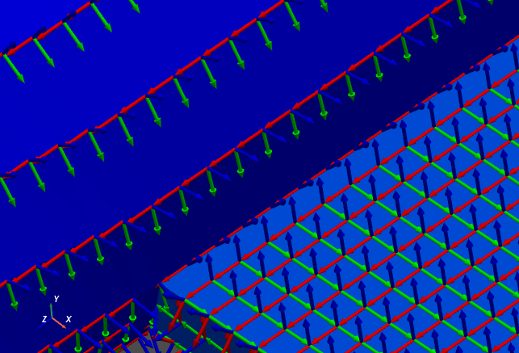

Creating Shapes from an Exodus File
~~~~~~~~~~~~~~~~~~~~~~~~~~~~~~~~~~~

We just finished extracting geometry with local coordinate systems.  We will
now extract shapes from the
:py:class:`sdpy.ExodusInMemory<sdynpy.fem.sdynpy_exodus.ExodusInMemory>`
object.  To do this, we will use the 
:py:func:`sdpy.shape.from_exodus<sdynpy.core.sdynpy_shape.from_exodus>`
function.  Note that shapes gathered from this function will be in the
global coordinate system, so we will assign the variable a name that denotes
that these are global shapes.

.. code-block:: python

    shapes_global = sdpy.shape.from_exodus(fexo)
    
Shapes
^^^^^^

At this point, it is useful to explore briefly the
:py:class:`ShapeArray<sdynpy.core.sdynpy_shape.ShapeArray>` object in the
IPython console.  The data type of the object is:

.. code-block:: console

    In [13]: shapes_global.dtype
    Out[13]: dtype([('frequency', '<f8'),
                    ('damping', '<f8'),
                    ('coordinate', [('node', '<u8'),
                                    ('direction', 'i1')], (38058,)),
                    ('shape_matrix', '<f8', (38058,)),
                    ('modal_mass', '<f8'), ('comment1', '<U80'),
                    ('comment2', '<U80'), ('comment3', '<U80'),
                    ('comment4', '<U80'), ('comment5', '<U80')])
                    
The data type of 
:py:class:`ShapeArray<sdynpy.core.sdynpy_shape.ShapeArray>` objects can change
depending on what type of shape and how many degrees of freedom are in the
shape.  ``frequency`` and ``damping`` fields are stored as 64-bit floating
point numbers with one value per entry in the 
:py:class:`ShapeArray<sdynpy.core.sdynpy_shape.ShapeArray>`.  ``modal_mass``
is also stored in the present
:py:class:`ShapeArray<sdynpy.core.sdynpy_shape.ShapeArray>`, but if the shape
is complex, then the modal mass might also be complex.  The ``shape_matrix``
field holds the underlying shape data.  It has one entry for every degree of
freedom in the shape, and is represented by a floating point number for
normal modes or a complex number for complex modes.  Similarly, the
``coordinate`` field identifies which degree of freedom belongs to which entry
in the ``shape_matrix`` field.  The ``coordinate`` field stores data as
:py:class:`CoordinateArray<sdynpy.core.sdynpy_coordinate.CoordinateArray>`
objects, and thus has the same data type as
:py:class:`CoordinateArray<sdynpy.core.sdynpy_coordinate.CoordinateArray>`.
Finally, there are five fields available for comments, which store string data
up to 80 characters which can be used to store any data the user feels is
relevant to the analysis.

One thing to note is that the ``shape_matrix`` field, due to the dimension of
the field being appended at the end of the array, will be transposed from the
typical representation of a mode shape matrix (degrees of freedom as rows and
mode indices as columns). The ``shape_matrix`` field will instead have the
shape of the :py:class:`ShapeArray<sdynpy.core.sdynpy_shape.ShapeArray>`
object itself as its first dimensions, and then the size of the ``coordinate``
field as its last dimension.

.. code-block:: console

    In [14]: shapes_global.shape
    Out[14]: (200,)
    
    In [15]: shapes_global.shape_matrix.shape
    Out[15]: (200, 38058)

Correcting Negative Frequencies and Array Views versus Copies
^^^^^^^^^^^^^^^^^^^^^^^^^^^^^^^^^^^^^^^^^^^^^^^^^^^^^^^^^^^^^

One thing to note is that sometimes finite element codes that solve for zero
frequency modes can have slight errors that result in small negative natural
frequencies.  These can, however, cause issues due to stiffness instabilities
if, for example, the system is integrated over time.  It is easy to set all of
these negative natural frequencies to positive natural frequencies.

.. code-block:: python

    shapes_global.frequency[shapes_global.frequency < 0] = 0

Note carefully here the order of operations in the above statement.  We have a
:py:class:`ShapeArray<sdynpy.core.sdynpy_shape.ShapeArray>` object containing
our shape data.  We then access the ``frequency`` field of that 
:py:class:`ShapeArray<sdynpy.core.sdynpy_shape.ShapeArray>` object and index
that array to select only those frequencies that are less than zero and set
them to zero.  Note the subtle difference to the following line of code.

.. code-block:: python

    shapes_global[shapes_global.frequency < 0].frequency = 0
    
In the above line of code, we first index our
:py:class:`ShapeArray<sdynpy.core.sdynpy_shape.ShapeArray>` object to access
only the shapes with frequency less than zero, then access the ``frequency``
field of just those shapes and assign to zero.  This seems like it should be
the identical operation, correct?  Indeed, both operations return the same
negative frequency values.

.. code-block:: console

    In [16]: shapes_global.frequency[shapes_global.frequency < 0]
    Out[16]: 
    array([-6.79983277e-05, -6.35834268e-05, -4.75579236e-05, -2.66030128e-05,
           -2.39180665e-05])
    
    In [17]: shapes_global[shapes_global.frequency < 0].frequency
    Out[17]: 
    array([-6.79983277e-05, -6.35834268e-05, -4.75579236e-05, -2.66030128e-05,
           -2.39180665e-05])

Experienced users of NumPy should readily identify the subtle difference
between the above two operations, however.  In the second, the ``shapes_global``
:py:class:`ShapeArray<sdynpy.core.sdynpy_shape.ShapeArray>` is indexed by a
logical array (a NumPy ``ndarray`` consisting of True and False, True where
the ``frequency`` field is less than 0).  This will trigger NumPy's advanced
indexing schemes, which *always return a copy of rather than a view into* the
underlying data.  Therefore, in the second case, what we are looking at is the
``frequency`` field of a *copy* of our ``shapes_global`` variable rather than
the raw data.  Similarly, assigning directly to this copy will not change the
data of the original ``shapes_global`` variable, as can be demonstrated in the
IPython console.

.. code-block:: console
    
    In [18]: shapes_global[shapes_global.frequency < 0].frequency
    Out[18]: 
    array([-6.79983277e-05, -6.35834268e-05, -4.75579236e-05, -2.66030128e-05,
           -2.39180665e-05])
    
    In [19]: shapes_global[shapes_global.frequency < 0].frequency = 0
    
    In [20]: shapes_global[shapes_global.frequency < 0].frequency
    Out[20]: 
    array([-6.79983277e-05, -6.35834268e-05, -4.75579236e-05, -2.66030128e-05,
           -2.39180665e-05])
           
We start by checking that there are negative frequencies, then we assign 
those frequencies to zero, then check again if there are negative frequencies.
Indeed the negative frequencies still exist!  Again to reiterate, this is
because we have assigned the zero frequencies to a copy of the original object.

The correct way to assign to field data is to do all indexing to the final
target array, which in this case is the ``frequency`` field.  By doing it this
way, the ``frequency`` field that we are referencing is still the same
``frequency`` field from the original ``shapes_global`` array, so assigning
to this array will modify the original ``shapes_global`` array's data.

.. code-block:: console
    
    In [21]: shapes_global.frequency[shapes_global.frequency < 0]
    Out[21]: 
    array([-6.79983277e-05, -6.35834268e-05, -4.75579236e-05, -2.66030128e-05,
           -2.39180665e-05])
    
    In [22]: shapes_global.frequency[shapes_global.frequency < 0] = 0
    
    In [23]: shapes_global.frequency[shapes_global.frequency < 0]
    Out[23]: array([], dtype=float64)
    
Here we see that if we do the indexing the correct way, after assigning the
``frequency`` field data to zero, there are no remaining negative frequencies
(an empty array is returned).

If the reader does not understand these concepts, they are encouraged to read
and understand the NumPy
`documentation on indexing <https://numpy.org/doc/stable/user/basics.indexing.html>`_,
otherwise misapplying these nuanced concepts can introduce bugs into analyses
performed using SDynPy.

Transforming Shape Coordinate Systems
^^^^^^^^^^^^^^^^^^^^^^^^^^^^^^^^^^^^^

As mentioned above, the shapes that come from the 
:py:func:`sdpy.shape.from_exodus<sdynpy.core.sdynpy_shape.from_exodus>`
function are defined in the global cordinate system.
We can see that if we plot the shapes on the ``geometry`` we loaded previously
using the
:py:func:`plot_shape<sdynpy.core.sdynpy_geometry.Geometry.plot_shape>` method of the
:py:class:`Geometry<sdynpy.core.sdynpy_geometry.Geometry>` object, the shapes
do not look right, due to plotting shapes defined using a global coordinate
system onto a geometry defined using local coordinate systems.
For example, the shape below should be a rigid body mode
of the system, but instead appears to be a torsional mode of the system.

.. code-block:: python

    plotter = geometry.plot_shape(shapes_global,plot_options)
    
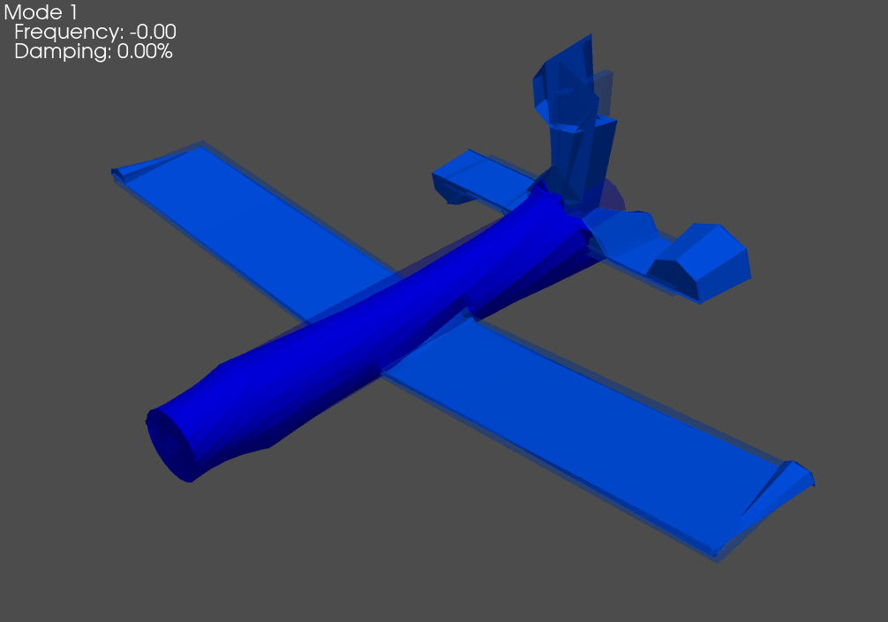

What we need to do is transform the global shapes into the local shapes defined
on the geometry.  We can do this using the 
:py:func:`transform_coordinate_system<sdynpy.core.sdynpy_shape.ShapeArray.transform_coordinate_system>`
method of the :py:class:`ShapeArray<sdynpy.core.sdynpy_shape.ShapeArray>` object.
This method takes two arguments; the first is a
:py:class:`Geometry<sdynpy.core.sdynpy_geometry.Geometry>` object that defines
the coordinate systems that we are transforming "from" and the second is a
:py:class:`Geometry<sdynpy.core.sdynpy_geometry.Geometry>` object that defines
the coordinate systems that we are transforming "to".  We already have the "to"
geometry in the form of the local geometry we loaded from the Exodus file.
We therefore only need to create a global geometry corresponding to the global
coordinate system that our shapes are currently defined in to transform "from".
This is easily done using the
:py:func:`sdpy.geometry.from_exodus<sdynpy.core.sdynpy_geometry.from_exodus>`
function while not passing in the arguments that specify the local coordinate
systems should be created.  Plotting the same ``coordinates``
:py:class:`CoordinateArray<sdynpy.core.sdynpy_coordinate.CoordinateArray>` on
this new geometry will verify that all node coordinate systems are aligned with
the global coordinate system.  We can also plot ``shapes_global`` with
``geometry_global`` to verify that the shapes look right.

.. code-block:: python

    # Get the global geometry
    geometry_global = sdpy.geometry.from_exodus(fexo)
    
    # Plot the coordinates on the global geometry
    plotter = geometry_global.plot_coordinate(coordinates,arrow_scale=0.005,
                                              plot_kwargs=plot_options)
    
    # Plot global shapes with global geometry
    plotter = geometry_global.plot_shape(shapes_global,plot_options)

.. image:: figures/airplane_global_coordinate_system_closeup.png
  :width: 600
  :alt: Airplane geometry with global coordinate systems shown close up.
  
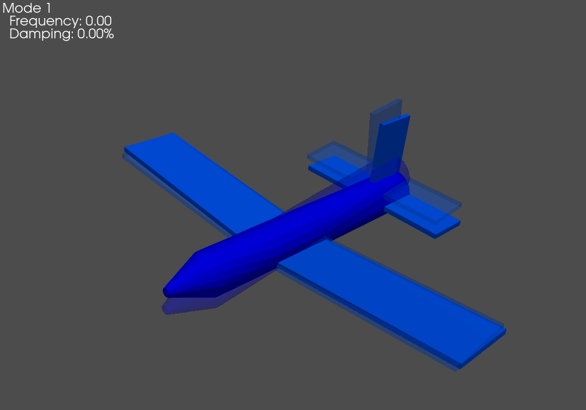

At this point, we have the requirements to transform coordinate systems.
We can now plot the local shapes with the local geometry to verify that the
shapes are indeed correct.  These shapes should look identical to the above
figure even though the underlying data is represented in a different coordinate
system.

.. code-block:: python

    # Transform shapes to local coordinate systems from global coordinate systems
    shapes = shapes_global.transform_coordinate_system(geometry_global, geometry)
    
    # Plot the local shapes on the local geometry to verify
    plotter = geometry.plot_shape(shapes,plot_options)
    
Optimizing Instrumentation for Test
-----------------------------------

The reason we went through all the trouble to create shapes in local
coordinate systems is that these are the coordinate systems in which test
instrumentation is generally placed.  We will now want to downselect a set of
sensors to use in the actual test from a candidate set of instruments.

For this example, we will use the effective independence algorithm implemented in
:py:func:`sdpy.dof.by_effective_independence<sdynpy.fem.sdynpy_dof.by_effective_independence>`.
This function starts with a candidate set of degrees of freedom and iteratively
throws away the degrees of freedom with the smallest contribution to the
effective independence of the system.  Because there are currently a lot of
nodes in our geometry (12,686), it will take a long time to consider each one
of these locations as a potential sensor in a test.  Instead, we will reduce
the candidate set by overlaying a grid of points over the test geometry with
a specified spacing.

We will first compute the maximum, minimum, and range of node positions in the
model to define the grid, and use NumPy's ``meshgrid`` function to assemble the
grid.

.. code-block:: python

    # Get the maximum and minimum of each component of the node positions (X,Y,Z)
    min_coords = geometry.node.coordinate.min(axis=0)
    max_coords = geometry.node.coordinate.max(axis=0)
    
    # Compute the size of the model in each direction
    range_coords = max_coords-min_coords
    
    # Specify the grid spacing that we want to use
    grid_spacing = 0.25
    
    # Compute the number of points along each direction in the grid
    num_grids = np.ceil(range_coords/grid_spacing).astype(int)
    
    # Create the grid in each dimension using linspace
    grid_arrays = [np.linspace(min,max,num) 
                   for min,max,num in zip(min_coords,max_coords,num_grids)]
    # Use meshgrid to assemble the array grid.  Flatten the point dimension and
    # transpose so the array has shape (n_points x 3)
    grid_points = np.array(np.meshgrid(*grid_arrays,indexing='ij')).reshape(3,-1).T
    
With the grid points defined, we can now select the nodes in the geometry
closest to these grid points by using the
:py:func:`by_position<sdynpy.core.sdynpy_geometry.NodeArray.by_position>` method
of the :py:class:`NodeArray<sdynpy.core.sdynpy_geometry.NodeArray>` object.
However, there are points on the grid that are not particularly close to any
node in the geometry (e.g. points above the wing at the level of the tail tip)
so we will further reduce the candidate nodes by only keeping those where the
closest node to a grid position is within the specified ``grid_spacing``.
The NumPy ``unique`` function can be used to eliminate repeated nodes if one
node ends up being closest to two grid points.

.. code-block:: python

    # Select nodes that are closest to the points in the grid
    candidate_nodes = geometry.node.by_position(grid_points)
    # Reduce to only nodes that are within one grid spacing of their requested point
    candidate_nodes = candidate_nodes[
        np.linalg.norm(candidate_nodes.coordinate - grid_points,axis=-1) < grid_spacing]
    # Remove duplicates
    candidate_node_ids = np.unique(candidate_nodes.id)
    
At this point we need to create the shape matrix that the effective independence
algorithm will use to downselect degrees of freedom.  We will first develop a
:py:class:`CoordinateArray<sdynpy.core.sdynpy_coordinate.CoordinateArray>`
containing the degrees of freedom of the candidate set.  We will use the helper
function :py:func:`sdpy.coordinate_array<sdynpy.core.sdynpy_coordinate.coordinate_array>`
to create this set of degrees of freedom, using NumPy's broadcasting
capabilities to fill out the array.
Here the nodes are the candidate node ids, and the directions are
1, 2, 3 corresponding to X+, Y+, Z+.  We pass in a shape 
(``candidate_node_ids.size`` x 1) array for the nodes and a shape (3) array for the
direction, which will be broadcast to a (``candidate_node_ids.size`` x 3) array
output where the rows correspond to the node id and the columns correspond to
each direction.  For more information on broadcasting, see the NumPy
`documentation <http://numpy.org/doc/stable/user/basics.broadcasting.html>`_.

.. code-block:: python

    # Create the candidate degree of freedom set
    candidate_dofs = sdpy.coordinate_array(candidate_node_ids[:,np.newaxis],[1,2,3])
    
    # Plot the degrees of freedom to verify they were created correctly
    geometry.plot_coordinate(candidate_dofs,arrow_scale=0.01,plot_kwargs = plot_options)

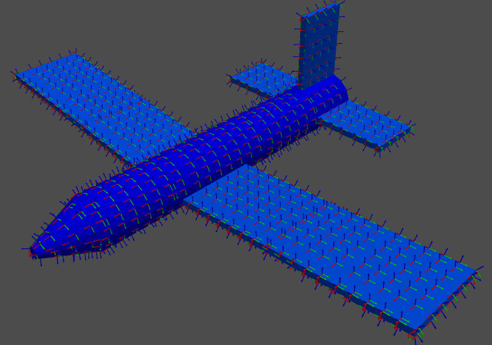

Now that we have selected our candidate degrees of freedom, we need to select
our target shapes.  Here we will consider the bandwidth of the test plus a bit
more to capture some effects of out-of-band modes.  We are interested in data
up to 200 Hz for this test, so we will consider shapes up to 300 Hz for this
instrumentation selection.

.. code-block:: python

    # Define the shape bandwidth
    shape_bandwidth = 300
    
    # Keep only shapes in the target set that have frequency less than the bandwidth
    target_shapes = shapes[shapes.frequency < shape_bandwidth]
    
Finally, the last definition needed is the number of sensors to keep.  In this
case, we will want to keep 30 triaxial accelerometers.

.. code-block:: python

    # Define the shape bandwidth
    sensors_to_keep = 30
    
At this point it is illustrative to examine what the 
:py:func:`sdpy.dof.by_effective_independence<sdynpy.fem.sdynpy_dof.by_effective_independence>`.
function wants as its arguments.  The first argument is ``sensors_to_keep``,
which is the number we just defined.  The second is the ``shape_matrix``.
Reading the documentation, this ``shape_matrix`` should have its first dimension
corresponding to each sensor (here a sensor could be a channel or group of
channels for a triaxial accelerometer) and its last dimension be correspond to
each target mode.  We will therefore want to set up a matrix with shape 
(``candidate_node_ids.size`` x 3 x ``target_shapes.size``).  This way, the
target shape dimension is last, and the group of channels corresponding to each
sensor is first.

Let's start setting this up.  We already have a shape
(``candidate_node_ids.size`` x 3) ``candidate_dofs``
:py:class:`CoordinateArray<sdynpy.core.sdynpy_coordinate.CoordinateArray>`.
We can use that coordinate array to index into the ``target_shapes``
:py:class:`ShapeArray<sdynpy.core.sdynpy_shape.ShapeArray>`.

.. code-block:: python

    # Get the shape matrix by indexing the target shapes with our candidate dofs
    shape_matrix = target_shapes[candidate_dofs]

Here it is illustrative to examine the sizes of the arrays in this operation in
the IPython console.

.. code-block:: console
    
    In [24]: target_shapes.shape
    Out[24]: (43,)
    
    In [25]: candidate_dofs.shape
    Out[25]: (1217, 3)
    
    In [26]: shape_matrix.shape
    Out[26]: (43, 1217, 3)
    
We see that we started with 43 shapes in our ``target_shapes`` array.  We then
index into that array with our (1217 x 3) ``candidate_dofs`` array.  This 
selects a (1217 x 3) shape matrix for each of the 43 shapes, resulting in a
final ``shape_matrix`` shape of (43 x 1217 x 3).  We are almost to the
desired shape of ``shape_matrix``.  However, as stated in the documentation, the
mode dimension of the array should be last, and the sensor dimension should be
first.  We simply need to move the first axis (index 0 in Python's 0-based
indexing) to the last index (index -1, where the negative index signifies
counting from the end of the array).  We can easily move array axes around
using NumPy's ``moveaxis`` function.

.. code-block:: python

    shape_matrix = np.moveaxis(shape_matrix,0,-1)

Now if we re-examine the shape in the IPython console, we see that it is the
proper shape.

.. code-block:: console
    
    In [27]: shape_matrix.shape
    Out[27]: (1217, 3, 43)
    
We can now run the sensor selection algorithm using the effective independence
objective function.  The sensor selection schemes are contained in
:py:mod:`sdpy.dof<sdynpy.fem.sdynpy_dof>`, and we will use the
:py:func:`sdpy.dof.by_effective_independence<sdynpy.fem.sdynpy_dof.by_effective_independence>`
function.  We give it our ``sensors_to_keep`` and ``shape_matrix``, as well as
give the optional flag to ``return_efi`` so we can visualize the effective
independence of the shape matrix as degrees of freedom are removed.  We can
plot this function, as well as the kept degrees of freedom by indexing the
oridinal set of degrees of freedom with the ``keep_indices`` returned from
the
:py:func:`by_effective_independence<sdynpy.fem.sdynpy_dof.by_effective_independence>`
function.  Intuitively, the sensors seem well-placed, with many positioned at
the boundaries of the wing and tail, as well as a few on the nose and fuselage.

.. code-block:: python

    keep_indices,efi = sdpy.dof.by_effective_independence(
        sensors_to_keep, shape_matrix,return_efi=True)
        
    # Plot the effective independence vs dofs
    fig,ax = plt.subplots(num='EFI vs DoF')
    ax.plot(shape_matrix.shape[0]-np.arange(len(efi)), efi)
    ax.set_yscale('log')
    ax.set_xlim(ax.get_xlim()[::-1])
    ax.set_ylabel('EFI')
    ax.set_xlabel('DoF Remaining')
    
    # Plot the kept dofs on the model
    keep_dofs = candidate_dofs[keep_indices]
    geometry.plot_coordinate(keep_dofs,arrow_scale=0.01,plot_kwargs = plot_options)

.. image:: figures/EFI_vs_DoF.png
  :width: 600
  :alt: Effective Independence vs Sensors remaining
  
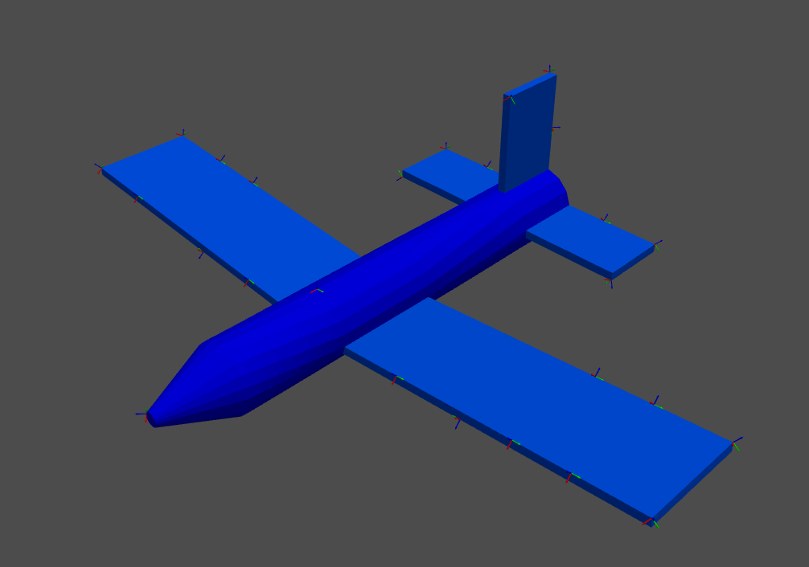
  
Creating a Test Geometry
------------------------

Because the test sensors are a small subset of the nodes on the original
finite element model, it can be useful to add visualization features to the
test geometry to help visualize responses from the test.  We have already
explored elements, which our finite element model has in abundance, so for the
test geometry we will use
:py:class:`tracelines<sdynpy.core.sdynpy_geometry.TracelineArray>`
to aid in visualization.  We will use the helper function
:py:func:`add_traceline<sdynpy.core.sdynpy_geometry.Geometry.add_traceline>`.

The first step in this process is to simply reduce the original geometry down
to our kept sensor locations. using the
:py:func:`reduce<sdynpy.core.sdynpy_geometry.Geometry.reduce>` method.
This method will discard any coordinate systems, tracelines, or elements that
do not entirely consist of the nodes that are kept, which in this case means
that the geometry will consist of only nodes and their coordinate systems.

.. code-block:: python
    
    # Create a test geometry and shapes to plot on the test geometry
    test_geometry = geometry.reduce(np.unique(keep_dofs.node))

.. code-block:: console
    
    In [28]: test_geometry
    Out[28]:
    Node
       Index,     ID,        X,        Y,        Z, DefCS, DisCS
        (0,),   2796,   -0.051,    0.497,   -2.562, 20497,  2796
        (1,),   5248,   -0.095,    0.031,    0.000, 20497,  5248
        (2,),   6157,   -4.970,    0.310,   -2.500, 20497,  6157
        (3,),   6172,   -1.413,   -0.001,   -2.500, 20497,  6172
        (4,),   6214,   -3.989,    0.224,   -2.500, 20497,  6214
        (5,),   6272,   -2.438,   -0.037,   -2.500, 20497,  6272
        (6,),   6376,   -4.970,    0.310,   -4.000, 20497,  6376
        (7,),   6392,   -3.989,    0.224,   -4.000, 20497,  6392
        (8,),   6405,   -3.192,    0.155,   -4.000, 20497,  6405
        (9,),   8143,   -1.384,   -0.129,   -4.000, 20497,  8143
       (10,),   8160,   -2.438,   -0.037,   -4.000, 20497,  8160
       (11,),  11664,    2.438,   -0.037,   -2.500, 20497, 11664
       (12,),  11705,    4.970,    0.310,   -2.500, 20497, 11705
       (13,),  11722,    3.989,    0.224,   -2.500, 20497, 11722
       (14,),  11735,    3.192,    0.155,   -2.500, 20497, 11735
       (15,),  11764,    1.413,   -0.001,   -2.500, 20497, 11764
       (16,),  11892,    2.438,   -0.037,   -4.000, 20497, 11892
       (17,),  11909,    1.384,   -0.129,   -4.000, 20497, 11909
       (18,),  13603,    4.970,    0.310,   -4.000, 20497, 13603
       (19,),  13647,    3.192,    0.155,   -4.000, 20497, 13647
       (20,),  13660,    3.989,    0.224,   -4.000, 20497, 13660
       (21,),  17107,    2.000,   -0.062,   -6.000, 20497, 17107
       (22,),  17563,    2.000,    0.062,   -7.000, 20497, 17563
       (23,),  17573,    1.123,    0.062,   -7.000, 20497, 17573
       (24,),  18331,    0.063,    2.000,   -6.000, 20497, 18331
       (25,),  18416,    0.063,    1.185,   -7.000, 20497, 18416
       (26,),  18787,   -0.062,    2.000,   -7.000, 20497, 18787
       (27,),  19579,   -2.000,   -0.062,   -6.000, 20497, 19579
       (28,),  19651,   -2.000,    0.063,   -7.000, 20497, 19651
       (29,),  19665,   -1.123,    0.063,   -7.000, 20497, 19665
    
    Coordinate_system
       Index,     ID,                 Name, Color,       Type
        (0,),   2796,       Node 2796 Disp,     1,  Cartesian
        (1,),   5248,       Node 5248 Disp,     1,  Cartesian
        (2,),   6157,       Node 6157 Disp,     1,  Cartesian
        (3,),   6172,       Node 6172 Disp,     1,  Cartesian
        (4,),   6214,       Node 6214 Disp,     1,  Cartesian
        (5,),   6272,       Node 6272 Disp,     1,  Cartesian
        (6,),   6376,       Node 6376 Disp,     1,  Cartesian
        (7,),   6392,       Node 6392 Disp,     1,  Cartesian
        (8,),   6405,       Node 6405 Disp,     1,  Cartesian
        (9,),   8143,       Node 8143 Disp,     1,  Cartesian
       (10,),   8160,       Node 8160 Disp,     1,  Cartesian
       (11,),  11664,      Node 11664 Disp,     1,  Cartesian
       (12,),  11705,      Node 11705 Disp,     1,  Cartesian
       (13,),  11722,      Node 11722 Disp,     1,  Cartesian
       (14,),  11735,      Node 11735 Disp,     1,  Cartesian
       (15,),  11764,      Node 11764 Disp,     1,  Cartesian
       (16,),  11892,      Node 11892 Disp,     1,  Cartesian
       (17,),  11909,      Node 11909 Disp,     1,  Cartesian
       (18,),  13603,      Node 13603 Disp,     1,  Cartesian
       (19,),  13647,      Node 13647 Disp,     1,  Cartesian
       (20,),  13660,      Node 13660 Disp,     1,  Cartesian
       (21,),  17107,      Node 17107 Disp,     1,  Cartesian
       (22,),  17563,      Node 17563 Disp,     1,  Cartesian
       (23,),  17573,      Node 17573 Disp,     1,  Cartesian
       (24,),  18331,      Node 18331 Disp,     1,  Cartesian
       (25,),  18416,      Node 18416 Disp,     1,  Cartesian
       (26,),  18787,      Node 18787 Disp,     1,  Cartesian
       (27,),  19579,      Node 19579 Disp,     1,  Cartesian
       (28,),  19651,      Node 19651 Disp,     1,  Cartesian
       (29,),  19665,      Node 19665 Disp,     1,  Cartesian
       (30,),  20497,               Global,     1,  Cartesian
    
    Traceline
       Index,     ID,          Description, Color, # Nodes
    ----------- Empty -------------
    
    Element
       Index,     ID, Type, Color, # Nodes
    ----------- Empty -------------
    
At this point, we would like to connect the nodes with tracelines.  We can
plot the kept sensor degrees of freedom on the reduced ``test_geometry``, and
specify ``label_dofs=True`` to create labels at each of the coordinates.  This
will allow us to easily see which nodes should be connected.

.. code-block:: python

    # Let's plot the coordinates with the dofs labeled to aid us in creating the
    # tracelines
    test_geometry.plot_coordinate(keep_dofs,arrow_scale=0.02,label_dofs=True)

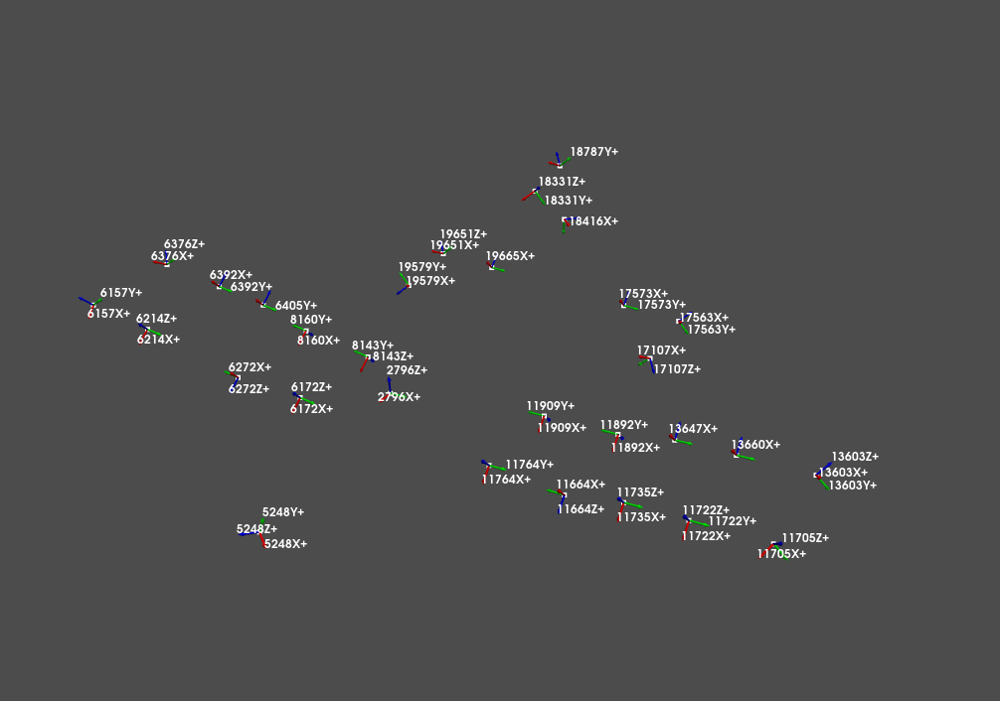
  
With the points labeled, it is easy to see which nodes should be connected using
tracelines.  When we create tracelines, we will also set the colors, using
``color=1`` (blue) for the fuselage, ``color=7`` (green) for the wings, and 
``color=13`` (pink) for the tail.  After the tracelines are added, it is much
easier to visualize the structure of the airplane.

.. code-block:: python

    # Fuselage
    test_geometry.add_traceline([5248,2796],color=1)
    # Wings
    test_geometry.add_traceline([6172,6272,6214,6157,6376,6392,6405,8160,8143,6172],color=7)
    test_geometry.add_traceline([11909,11892,13647,13660,13603,11705,11722,11735,11664,11764,11909],color=7)
    # Tail
    test_geometry.add_traceline([19579,19651,19665,19579],color=13)
    test_geometry.add_traceline([17573,17563,17107,17573],color=13)
    test_geometry.add_traceline([18787,18416,18331,18787],color=13)
    
    # Now plot the geometry to see the tracelines
    test_geometry.plot_coordinate(keep_dofs,arrow_scale=0.02,label_dofs=True,plot_kwargs=plot_options)
    
.. image:: figures/test_geometry_with_tracelines_labeled.png
  :width: 600
  :alt: Labeled degrees of freedom on the test geometry with tracelines
  
It is also useful to reduce the shapes down to the test degrees of freedom,
which we can do using the
:py:func:`ShapeArray.reduce<sdynpy.core.sdynpy_shape.ShapeArray.reduce>` method,
and we will need to specify a damping value (here 2% is used) as there is no
damping in the finite element model.  We can then plot our test shapes on our
test geometry to make sure everything looks right.  We can look at the
Modal Assurance Criterion matrix of our reduced set of shapes to
ensure that we can distinguish the shapes from the test sensors.  The MAC
can be computed with the 
:py:func:`ShapeArray.mac<sdynpy.core.sdynpy_shape.mac>` function, and the
matrix can be plotted nicely using the
:py:func:`sdpy.correlation.matrix_plot<sdynpy.signal_processing.sdynpy_correlation.matrix_plot>`
function.

.. code-block:: python

    # Now get the test shapes by reducing the target shapes to the test dofs
    test_shapes = target_shapes.reduce(keep_dofs.flatten())
    # We'll need to add damping to the model too
    test_shapes.damping=0.02
    # Plot the geometry to see what it looks like
    test_geometry.plot_shape(test_shapes,plot_options)
    # Look at the mac for the target shapes with our set of degrees of freedom
    sdpy.correlation.matrix_plot(sdpy.shape.mac(test_shapes),text_size = 8)
    
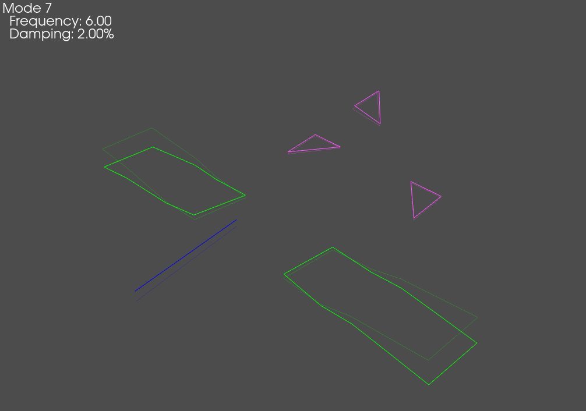
  
.. image:: figures/test_mac.png
  :width: 600
  :alt: MAC matrix of the test shapes
  
OOPS! An Instrumentation Error!
~~~~~~~~~~~~~~~~~~~~~~~~~~~~~~~

Installing instrumentation is a tedious process that must be well-documented
for success of a given test.  For large channel-count tests, it is almost
inevitable that there will be some kind of sensor or geometry error, so it is
useful to develop workflows to verify that sensors are oriented correctly.
Here we will purposefully introduce an instrumentation error by setting the
displacement coordinate system of one of our sensors to the global coordinate
system rather than its correct local coordinate system.  We will then
investigate a workflow in SDynPy for identifying correcting this error.

.. code-block:: python

    # Copy the geometry so we don't overwrite our correct version
    test_geometry_error = test_geometry.copy()
    # Change the displacement coordinate system of the 5th node to the global
    # coordinate system
    test_geometry_error.node.disp_cs[4] = test_geometry_error.coordinate_system.id[-1]

Running a Virtual Experiment: Rigid Body Checkouts
--------------------------------------------------

One approach to validating the test geometry and channel table is to perform
rigid body checks, where the structure is
excited at a frequency well below the elastic modes of the system to elicit a
rigid body response.  These response shapes can be visualized on the geometry
and should appear rigid.  If, for example, a sensor is moving out of phase
with the rest of the sensors, it is fairly certain there is an instrumentation
or bookkeeping error.  When looking at acceleration response, these rigid
shapes should also have very small imaginary parts compared to their real parts.
Finally, a projector can be used to project the measured rigid body shapes
through analytic rigid body shapes created from the test geometry.  This
operation will remove any "non-rigid" components of the measured shapes.  By
subtracting this "rigidized" version from the measured shapes, a residual can
be created where large values in the residual point to non-rigid motions.

.. math::
    \mathbf{R} = \mathbf{\Phi} - \mathbf{\Phi}_a{\mathbf{\Phi}_a}^+\mathbf{\Phi}

Creating a System Object to Integrate
~~~~~~~~~~~~~~~~~~~~~~~~~~~~~~~~~~~~~

We will now simulate one of these rigid body tests by integrating equations of
motion.  SDynPy uses :py:class:`System<sdynpy.core.sdynpy_system.System>`
objects to represent dynamical systems.  
:py:class:`System<sdynpy.core.sdynpy_system.System>` objects contain mass,
stiffness, and damping matrices.  They also can contain a transformation matrix
to return to physical coordinates if the internal state degrees of freedom are
represented in a reduced space (for example, a mode shape matrix is the
transformation between modal mass, stiffness, and damping matrices and the
corresponding physical coordinates).
:py:class:`System<sdynpy.core.sdynpy_system.System>` objects also contain
a :py:class:`coordinate<sdynpy.core.sdynpy_coordinate.CoordinateArray>`
to aid in bookkeeping.

We can easily create a modal :py:class:`System<sdynpy.core.sdynpy_system.System>`
from our existing shapes by using the
:py:func:`ShapeArray.system<sdynpy.core.sdynpy_shape.ShapeArray.system>` method.
This will return a state matrix in modal space.  We can use the
:py:func:`System.spy<sdynpy.core.sdynpy_system.System.spy>` method to visualize
the structure of the created system.

.. code-block:: python

    # Create a System from the test shapes
    test_system = test_shapes.system()
    # Look at the structure of the System object
    test_system.spy()
    
.. image:: figures/modal_system_spy.png
  :width: 600
  :alt: Structure of the test system object

We can see from the above matrix plot that the internal state is diagonal,
consisting of 43 modal degrees of freedom, whereas the transformation matrices
(which are the mode shape matrices in this case) are full, consisting of 90
physical degrees of freedom.

Exploring the System Object
^^^^^^^^^^^^^^^^^^^^^^^^^^^

Here is a good place to take time to investigate the
:py:class:`System<sdynpy.core.sdynpy_system.System>`
object we have just created.  We can look at the ``mass``, ``stiffness``, and
``damping`` attributes to see those matrices, and verify that they are indeed
diagonal for the modal system we have created.

.. code-block:: console

    In [29]: test_system.mass
    Out[29]: 
    array([[1., 0., 0., ..., 0., 0., 0.],
           [0., 1., 0., ..., 0., 0., 0.],
           [0., 0., 1., ..., 0., 0., 0.],
           ...,
           [0., 0., 0., ..., 1., 0., 0.],
           [0., 0., 0., ..., 0., 1., 0.],
           [0., 0., 0., ..., 0., 0., 1.]])
    
    In [30]: test_system.stiffness
    Out[30]: 
    array([[      0.        ,       0.        ,       0.        , ...,
                  0.        ,       0.        ,       0.        ],
           [      0.        ,       0.        ,       0.        , ...,
                  0.        ,       0.        ,       0.        ],
           [      0.        ,       0.        ,       0.        , ...,
                  0.        ,       0.        ,       0.        ],
           ...,
           [      0.        ,       0.        ,       0.        , ...,
            2868905.99964993,       0.        ,       0.        ],
           [      0.        ,       0.        ,       0.        , ...,
                  0.        , 3210105.88194563,       0.        ],
           [      0.        ,       0.        ,       0.        , ...,
                  0.        ,       0.        , 3289727.48791008]])
    
    In [31]: test_system.damping
    Out[31]: 
    array([[ 0.        ,  0.        ,  0.        , ...,  0.        ,
             0.        ,  0.        ],
           [ 0.        ,  0.        ,  0.        , ...,  0.        ,
             0.        ,  0.        ],
           [ 0.        ,  0.        ,  0.        , ...,  0.        ,
             0.        ,  0.        ],
           ...,
           [ 0.        ,  0.        ,  0.        , ..., 67.75138079,
             0.        ,  0.        ],
           [ 0.        ,  0.        ,  0.        , ...,  0.        ,
            71.66707341,  0.        ],
           [ 0.        ,  0.        ,  0.        , ...,  0.        ,
             0.        , 72.55042371]])

We can also look at the ``transformation`` and ``coordinate`` to see
that the bookkeeping from internal state (modal) degree of freedom to
physical degree of freedom is maintained.
    
.. code-block:: console
    
    In [32]: test_system.transformation
    Out[32]: 
    array([[-2.76026978e-03, -1.40194807e-03,  4.58617331e-03, ...,
             1.73749203e-03, -3.09022372e-04, -1.68270938e-05],
           [ 6.53050658e-04, -5.80137822e-04, -2.07032636e-03, ...,
             1.46528917e-04,  6.02431820e-04, -5.76349533e-03],
           [ 1.69407153e-03,  3.83686628e-04, -7.59999135e-04, ...,
             5.49012119e-04,  2.74121905e-03,  2.04985114e-04],
           ...,
           [-8.55739072e-03,  8.65502669e-04,  9.38297408e-04, ...,
             1.34896916e-02,  3.71546727e-03,  1.47339469e-03],
           [-4.93925263e-05, -8.19915019e-03, -2.66942214e-03, ...,
             2.39905468e-03, -1.48742295e-05, -2.91024169e-05],
           [-6.55791597e-03,  3.30305914e-04, -6.16004354e-03, ...,
             1.31560277e-02,  3.15253196e-03,  1.19728196e-03]])
    
    In [33]: test_system.coordinate
    Out[33]: 
    coordinate_array(string_array=
    array(['2796X+', '2796Y+', '2796Z+', '5248X+', '5248Y+', '5248Z+',
           '6157X+', '6157Y+', '6157Z+', '6172X+', '6172Y+', '6172Z+',
           '6214X+', '6214Y+', '6214Z+', '6272X+', '6272Y+', '6272Z+',
           '6376X+', '6376Y+', '6376Z+', '6392X+', '6392Y+', '6392Z+',
           '6405X+', '6405Y+', '6405Z+', '8143X+', '8143Y+', '8143Z+',
           '8160X+', '8160Y+', '8160Z+', '11664X+', '11664Y+', '11664Z+',
           '11705X+', '11705Y+', '11705Z+', '11722X+', '11722Y+', '11722Z+',
           '11735X+', '11735Y+', '11735Z+', '11764X+', '11764Y+', '11764Z+',
           '11892X+', '11892Y+', '11892Z+', '11909X+', '11909Y+', '11909Z+',
           '13603X+', '13603Y+', '13603Z+', '13647X+', '13647Y+', '13647Z+',
           '13660X+', '13660Y+', '13660Z+', '17107X+', '17107Y+', '17107Z+',
           '17563X+', '17563Y+', '17563Z+', '17573X+', '17573Y+', '17573Z+',
           '18331X+', '18331Y+', '18331Z+', '18416X+', '18416Y+', '18416Z+',
           '18787X+', '18787Y+', '18787Z+', '19579X+', '19579Y+', '19579Z+',
           '19651X+', '19651Y+', '19651Z+', '19665X+', '19665Y+', '19665Z+'],
          dtype='<U7'))
          
Setting up the Integration and Forcing Function
~~~~~~~~~~~~~~~~~~~~~~~~~~~~~~~~~~~~~~~~~~~~~~~

We aim integrate our ``test_system`` using the
:py:func:`System.time_integrate<sdynpy.core.sdynpy_system.System.time_integrate>`
method, but first we need to set up its required
sampling parameters.  We will specify our test bandwidth, as well as an
integration oversample factor to ensure that the integration is performed
accurately.  
:py:class:`System<sdynpy.core.sdynpy_system.System>` objects represent Linear,
Time-Invariant systems, so the
`scipy.signal.lsim <https://docs.scipy.org/doc/scipy/reference/generated/scipy.signal.lsim.html>`_
function is used for integration within the
:py:func:`System.time_integrate<sdynpy.core.sdynpy_system.System.time_integrate>`
function, and this typically only requires a factor of 10x the desired
sampling rate to achieve reasonable results.  We will also define the desired
frequency spacing for the test.  The other sampling parameters can be
derived from these definitions.  We will measure 10 frames so averaging
can be performed when computing frequency response functions.

.. code-block:: python

    # First let's set up our general sampling parameters for our test.
    test_bandwidth = 200 # Hz
    integration_oversample = 10 #x
    sample_rate = test_bandwidth*2*integration_oversample
    dt = 1/sample_rate
    df = 0.125 # Hz
    samples_per_frame = int(sample_rate/df)
    rb_frames = 10
    
We will now create the forcing function for our rigid body test, which will be
a sine wave.  The first elastic mode of the test article is near 6 Hz, so we
choose a frequency that is much lower than that value.  We can then use the
:py:func:`sdpy.generator.sine<sdynpy.signal_processing.sdynpy_generator.sine>`
function to produce a sine wave with the proper sampling parameters.

.. code-block:: python

    # Now we will create a sine signal that we can use for rigid body checkouts
    rb_frequency = 0.5 # Hz
    force = sdpy.generator.sine(rb_frequency, dt, samples_per_frame*rb_frames)
    # Plot the sine wave to make sure it is correct
    fig,ax = plt.subplots(num='Sine Force Signal')
    ax.plot(np.arange(samples_per_frame*rb_frames)*dt,force)
    
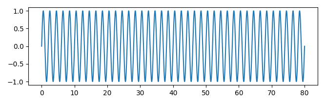

Finally, we will chose the coordinates at which we will excite the structure.
We can examine our previous plots of the labeled test geometry to identify
degrees of freedom that are approximately through the center of gravity of the
structure, which will result in approximately translational motions.

.. code-block:: python

    # To run the rigid body tests, we select degrees of freedom approximately
    # through the CG of the part.
    rb_coordinates = sdpy.coordinate_array(string_array=['2796Z+','11722Y+','2796X+'])

Running the Integration to Generate Synthetic Test Data
~~~~~~~~~~~~~~~~~~~~~~~~~~~~~~~~~~~~~~~~~~~~~~~~~~~~~~~

We will now loop through each of our excitation degrees of freedom and integrate
the System's response to the force located at that postiion using
:py:func:`System.time_integrate<sdynpy.core.sdynpy_system.System.time_integrate>`.
This will give us references and responses as
:py:class:`TimeHistoryArray<sdynpy.core.sdynpy_data.TimeHistoryArray>` objects.
We will then truncate off the first second of the response in order to remove
the startup transients from the data using
:py:func:`TimeHistoryArray.extract_elements_by_abscissa<sdynpy.core.sdynpy_data.TimeHistoryArray.extract_elements_by_abscissa>`.
We will then pass the truncated data into the
:py:func:`sdpy.TransferFunctionArray.from_time_data<sdynpy.core.sdynpy_data.TransferFunctionArray.from_time_data>`
function to produce frequency response functions as a
:py:class:`TransferFunctionArray<sdynpy.core.sdynpy_data.TransferFunctionArray>`
object.  Once the frequency response functions are computed, we can query the
``ordinate`` field of the 
:py:class:`TransferFunctionArray<sdynpy.core.sdynpy_data.TransferFunctionArray>`
to get the deflection shape, which we will store into a
:py:class:`ShapeArray<sdynpy.core.sdynpy_shape.ShapeArray>` object using the
:py:func:`sdpy.shape_array<sdynpy.core.sdynpy_shape.shape_array>` helper
function.  We append each shape to a running list, and then concatenate all the
shapes into one :py:class:`ShapeArray<sdynpy.core.sdynpy_shape.ShapeArray>`
object, which we can plot on our erroneous geometry.

.. code-block:: python

    # Create a list to hold our shapes
    rb_shapes = []
    # Loop through each of our excitation locations
    for rb_coordinate in rb_coordinates:
        # Perform time integration to get the responses to our sine wave
        print('Integrating Rigid Body Excitation at {:}'.format(str(rb_coordinate)))
        responses,references = test_system.time_integrate(
            force,dt,references=rb_coordinate)
        # Plot the responses and references
        fig,ax = plt.subplots(2,1,sharex=True,
                              num='Rigid Body Test {:}'.format(str(rb_coordinate)))
        responses.plot(ax[0])
        ax[0].set_ylabel('Acceleration')
        references.plot(ax[1])
        ax[1].set_ylabel('Force')
        # Truncate the initial portions of the functions so we eliminate the
        # transient portion of the response
        responses = responses.extract_elements_by_abscissa(1,np.inf)
        references = references.extract_elements_by_abscissa(1,np.inf)
        # Now we want to create an FRF from the references and responses
        frf = sdpy.TransferFunctionArray.from_time_data(references,responses,samples_per_frame)
        # Now we want to get the value at our frequency line because the rest will
        # be noise
        frequency_index = np.argmin(abs(frf[0,0].abscissa - rb_frequency))
        shape_matrix = frf.ordinate[...,frequency_index]
        # Now let's create a shapearray object so we can plot the shapes
        rb_shape = sdpy.shape_array(frf[:,0].response_coordinate,shape_matrix.T,
                                    rb_frequency,comment1=str(rb_coordinate))
        rb_shapes.append(rb_shape)
        
    # Combine all rb_shapes into one shape array
    rb_shapes = np.concatenate(rb_shapes)
    
    # Now let's plot those shapes on our (incorrect) geometry
    test_geometry_error.plot_shape(rb_shapes,plot_options)

Throughout the above code, the responses and reference signal were plotted; a
representative figure is shown below, showing the sinusoidal response of the
system at the requested degrees of freedom.

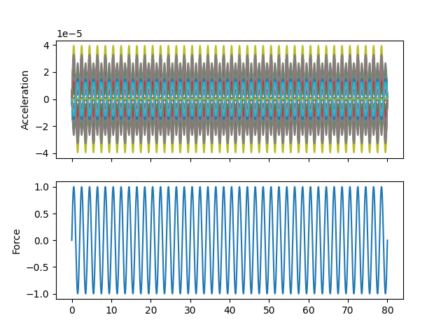
  
When we plot the measured rigid shapes against the geometry where we
intentionally introduce errors, we see that one of the sensors on the wing
seems to be moving opposite the rest of the wing.  We will investigate this
more thoroughly in a moment.
  
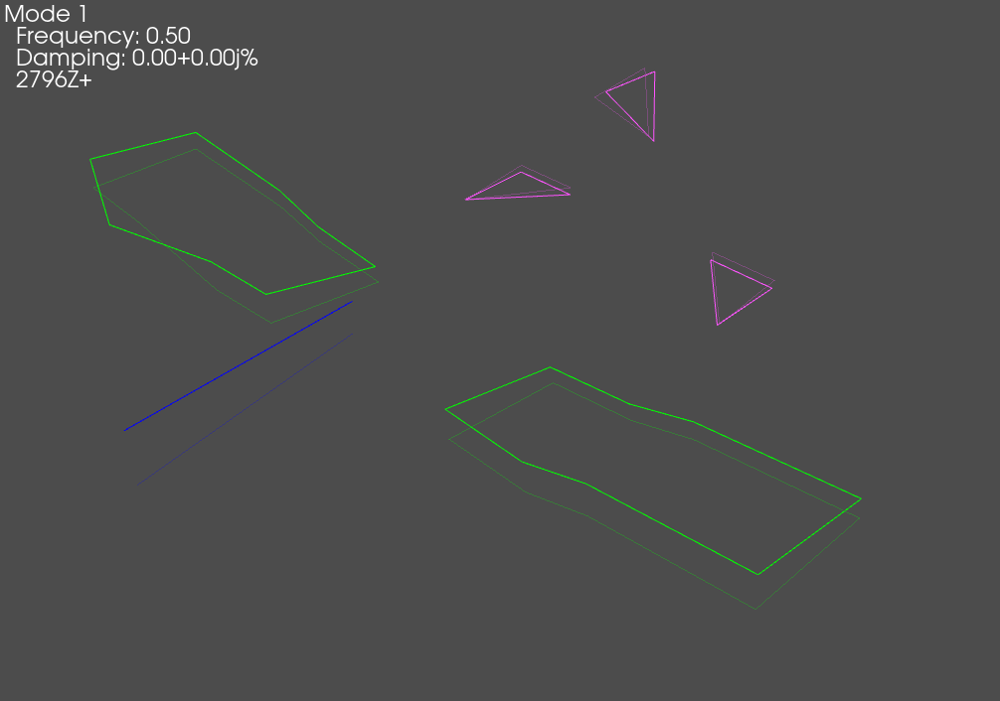
  
Exploring Time Data Objects
~~~~~~~~~~~~~~~~~~~~~~~~~~~

Before we move on to analyzing the rigid body datasets, we will first take some
time to explore some of the data objects that we have created.  Namely, we
generated some 
:py:class:`TimeHistoryArray<sdynpy.core.sdynpy_data.TimeHistoryArray>` objects
and a 
:py:class:`TransferFunctionArray<sdynpy.core.sdynpy_data.TransferFunctionArray>`
object for each excitation degree of freedom.

In SDynPy, all data objects inherit from the
:py:class:`NDDataArray<sdynpy.core.sdynpy_data.NDDataArray>` class, which
represents a general, multi-dimensional data container.  This class, in turn,
inherits from the :py:class:`SdynpyArray<sdynpy.core.sdynpy_array.SdynpyArray>`,
so all the broadcasting and attribute access features are available as well.

We will start by examining ``responses`` from the previous block of code.  We
see that it is a 
:py:class:`TimeHistoryArray<sdynpy.core.sdynpy_data.TimeHistoryArray>` object.
We can look at its ``dtype`` to see what data it contains.

.. code-block:: console

    In [34]: responses
    Out[34]: TimeHistoryArray with shape 90 and 316000 elements per function
    
    In [35]: responses.dtype
    Out[35]: dtype([('abscissa', '<f4', (316000,)), 
                    ('ordinate', '<f8', (316000,)),
                    ('comment1', '<U80'),
                    ('comment2', '<U80'),
                    ('comment3', '<U80'),
                    ('comment4', '<U80'),
                    ('comment5', '<U80'),
                    ('coordinate', 
                         [('node', '<u8'), ('direction', 'i1')],
                         (1,))
                   ])

Being a :py:class:`TimeHistoryArray<sdynpy.core.sdynpy_data.TimeHistoryArray>`
object, responses consists of real data.  It has floating point ``abscissa``
and ``ordinate`` fields to contain the independent time and dependent response
variables, respectively.  Note that the ``abscissa`` and ``ordinate`` fields
have the size of the length of the data record; in this case, it the time
data consists of 316,000 samples.  It also has five 80-character string fields
where comments can be stored.  Finally, it has a ``coordinate`` field that stores
the degree of freedom information for each data record.  Note the rather
peculiar length 1 on the ``coordinate`` field.  This is to signify that a time
history signal can be considered a 1D data array, which we will see is contrary
to, for example,
:py:class:`TransferFunctionArray<sdynpy.core.sdynpy_data.TransferFunctionArray>`
objects which are 2D, having both a response (output) coordinate and a reference
(input) coordinate.  Again, remember that these extra dimensions are appended
to the :py:class:`TimeHistoryArray<sdynpy.core.sdynpy_data.TimeHistoryArray>`
dimensions.

.. code-block:: console

    In [35]: responses.shape
    Out[35]: (90,)
    
    In [36]: responses.ordinate.shape
    Out[36]: (90, 316000)
    
    In [37]: responses.coordinate.shape
    Out[37]: (90, 1)
    
Consider the previous object in contrast to the ``frf`` variable, which is a
:py:class:`TransferFunctionArray<sdynpy.core.sdynpy_data.TransferFunctionArray>`
object.

.. code-block:: console

    In [38]: frf
    Out[38]: TransferFunctionArray with shape 90 x 1 and 16000 elements per function
    
    In [39]: frf.dtype
    Out[39]: dtype([('abscissa', '<f4', (16000,)),
                    ('ordinate', '<c16', (16000,)),
                    ('comment1', '<U80'),
                    ('comment2', '<U80'),
                    ('comment3', '<U80'),
                    ('comment4', '<U80'),
                    ('comment5', '<U80'),
                    ('coordinate',
                         [('node', '<u8'), ('direction', 'i1')],
                         (2,))
                    ])
                    
:py:class:`TransferFunctionArray<sdynpy.core.sdynpy_data.TransferFunctionArray>`
has all the same fields as 
:py:class:`TimeHistoryArray<sdynpy.core.sdynpy_data.TimeHistoryArray>`,
except they are different shapes and types.  Because frequency response data
is complex, the ``ordinate`` field is now a 16-byte complex number rather than
an 8-byte floating point number.  Similarly, because there are now reference
and response coordinates associated with each data record, the length of the
``coordinate`` field is now 2. 

Identifying Bad Geometry with Rigid Body Checkouts in SDynPy
~~~~~~~~~~~~~~~~~~~~~~~~~~~~~~~~~~~~~~~~~~~~~~~~~~~~~~~~~~~~

Now that we've understood the data objects a bit better, we can return to the
task at hand, which is to sort out our geometry and channel table, which has
an intentionally incorrect sensor.

SDynPy has some built-in tools for doing rigid body checkouts, plotting the
complex plane and the residual discussed previously.  These are contained in
the :py:func:`sdpy.shape.rigid_body_check<sdynpy.core.sdynpy_shape.rigid_body_check>`
function.  Simply give the function the geometry and shapes, and it will
attempt to figure out which nodes are suspicious and warrant further
investigation.

.. code-block:: python

    # It looks like there is an error in the shapes (go figure!).  Let's perform
    # a more quantitative analysis on the shapes to see what is wrong
    suspicious_dofs = sdpy.shape.rigid_body_check(
        test_geometry_error, rb_shapes)

We can see on the complex plane plots that the imaginary part is significantly
smaller than the real part, meaning we are well away from elastic modes and
all of our gauges have the correct phase.  The residual plot immediately
highlights the sensors that are not behaving like they should, which allows
the test engineer to hone in on that sensor to figure out what is wrong.

.. image:: figures/rigid_body_check_complex_plane.png
  :width: 600
  :alt: Real and imaginary parts of the complex shape
  
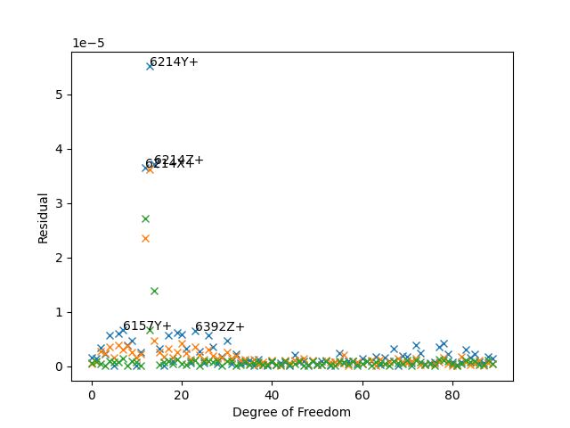
  
While the example problem shown here only has external sensors, many times
internal sensors may be suspicious, and without access to them, it can be
difficult to investigate the potential incorrect orientations of the sensors.
For this reason, SDynPy includes an approach to identify the "best" orientation
of the sensor using the
:py:func:`sdpy.shape.rigid_body_fix_node_orientation<sdynpy.core.sdynpy_shape.rigid_body_fix_node_orientation>`
function.  If we give this function a geometry, a set of rigid shapes, and a
list of suspicious nodes, it will attempt to find the correct orientation of
of the sensors at the suspicious nodes.

.. code-block:: python

    # Let's see if we can't let SDynPy figure out the correct orientation for that
    # sensor in the geometry given the data.
    suspicious_nodes = np.unique(suspicious_dofs.node)
    test_geometry_corrected = sdpy.shape.rigid_body_fix_node_orientation(
        test_geometry_error, rb_shapes,suspicious_nodes)
        
    # Let's see what the fix looks like compared to the way the sensor is actually
    # oriented
    test_geometry_error.plot_coordinate(
        sdpy.coordinate.from_nodelist(suspicious_nodes),label_dofs=True,
        plot_kwargs=plot_options)
    test_geometry_corrected.plot_coordinate(
        sdpy.coordinate.from_nodelist(suspicious_nodes),label_dofs=True,
        plot_kwargs=plot_options)
    test_geometry.plot_coordinate(
        sdpy.coordinate.from_nodelist(suspicious_nodes),label_dofs=True,
        plot_kwargs=plot_options)
        
    # Plot the rigid shapes on the corrected geometry
    test_geometry_corrected.plot_shape(rb_shapes,plot_options)

We see that when we plotted the coordinate systems, SDynPy was able to take the
initial erroneous coordinate system (left) and correct it (center) so that it
matched the original coordinate system (right) that we had before we introduced
the instrumentation error.

.. image:: figures/geometry_error.png
  :width: 30%
  :alt: Erroneous coordinate system
.. image:: figures/geometry_corrected.png
  :width: 30%
  :alt: Corrected coordinate system
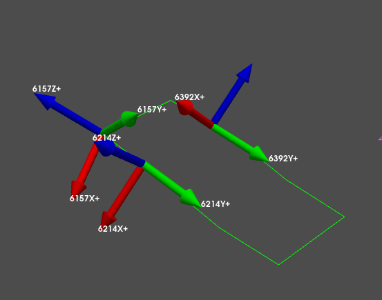
  
We see now that when we plot the shapes on the corrected geometry, it indeed
looks like rigid motion.

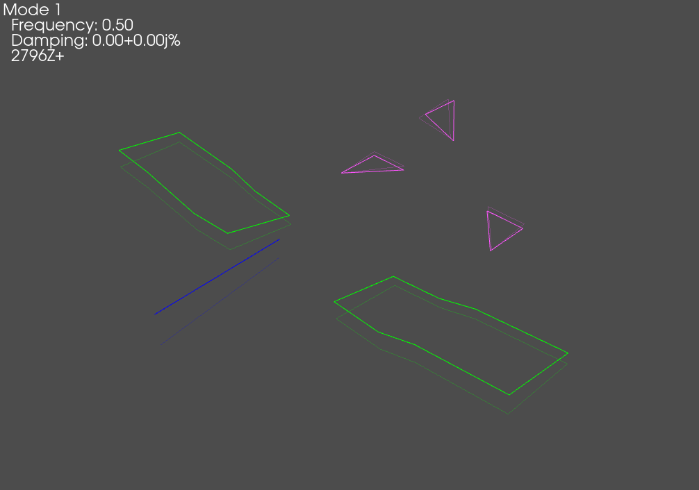
  
Running a Virtual Experiment: Modal Testing
-------------------------------------------

Now that we have validated test geometry, it is time to perform a modal test.
Again, we will simulate this virtually for this test.

The first thing we will do is select drive points to get all of the modes of
the system.  We will simply select positions here intuitively.  We will select
wing tips, tail tip, and nose points.

.. code-block:: python

    drive_points = sdpy.coordinate_array(string_array=[
        '6157Z+',
        '11705Z+',
        '18787Y+',
        '5248Y+',
        ])
    
    test_geometry.plot_coordinate(drive_points,plot_kwargs=plot_options,
                                  label_dofs=True)
                                  
.. image:: figures/airplane_modal_drive_points.png
  :width: 600
  :alt: Drive points used for a MIMO modal test.
  
Now we would like to set up a force for our modal test.  Here we will use a
random excitation, which will enable us to excite the structure with all
drive points simultaneously, which results in a Multiple-Input, Multiple-Output
modal test.

We can set up a random force using the
:py:func:`sdpy.generator.random<sdynpy.signal_processing.sdynpy_generator.random>`
function.  We will provide it the number of forces, the total number of samples,
the time step, and a high-frequency cutoff to ensure that we don't have
aliasing when we downsample from the integration oversampling factor back to our
test bandwidth.

.. code-block:: python

    # Now let's create a force.  We will do a random excitation
    modal_frames = 30
    random_forces = sdpy.generator.random(
        drive_points.shape,modal_frames*samples_per_frame,dt=dt,
        high_frequency_cutoff=test_bandwidth)
    # Look at the signal statistics
    rms = np.sqrt(np.mean(random_forces**2,axis=-1))
    fig,ax = plt.subplots(2,1,num='Random Excitation')
    ax[0].plot(np.arange(random_forces.shape[-1])*dt,
               random_forces.T)
    ax[0].set_ylabel('Force')
    ax[0].set_xlabel('Time')
    freq = np.fft.rfftfreq(random_forces.shape[-1],dt)
    fft = np.fft.rfft(random_forces,axis=-1)
    ax[1].plot(freq,abs(fft.T))
    ax[1].set_ylabel('Force')
    ax[1].set_yscale('log')
    ax[1].set_xlabel('Frequency')

Here we see we have random signal with a sharp cutoff in the frequency domain.
We have 4 signals, one for each force location.

.. image:: figures/Airplane_Random_Excitation.png
  :width: 600
  :alt: Random signals used to excite the modal test
  
We will again do integration of our test system using the
:py:func:`System.time_integrate<sdynpy.core.sdynpy_system.System.time_integrate>`
function, and we will then downsample the resulting data to our test bandwidth.
We can again pass the reference and response data into the 
:py:func:`sdpy.TransferFunctionArray.from_time_data<sdynpy.core.sdynpy_data.TransferFunctionArray.from_time_data>`
function to compute FRFs.  Note that because we now have random data, we will
use a window function and apply an overlap.

.. code-block:: python

    # Now let's run the modal test
    responses_modal,references_modal = test_system.time_integrate(
            random_forces,dt,references=drive_points)
    
    # Now let's downsample to the actual measurement (removing the 10x integration
    # oversample)
    responses_sampled = responses_modal.extract_elements(slice(None,None,integration_oversample))
    references_sampled = references_modal.extract_elements(slice(None,None,integration_oversample))
    
    # Compute FRFs.
    frf_sampled = sdpy.TransferFunctionArray.from_time_data(
        references_sampled,responses_sampled,samples_per_frame//integration_oversample,
        overlap=0.5,window='hann')

Since we now have a large number of FRFs, it can be
difficult to visualize them all simultaneously, so we will use SDynpy's
:py:class:`GUIPlot<sdynpy.core.sdynpy_data.GUIPlot>` to allow us to quickly
look through all the functions to ensure they look right.

.. code-block:: python
    
    # Now let's use GUIPlot to look at the functions
    plotter = sdpy.GUIPlot(frf_sampled)

.. image:: figures/airplane_gui_plot.png
  :width: 600
  :alt: Drive points used for a MIMO modal test.
  
Fitting Modes using PolyMax
---------------------------

Now that we have frequency response functions created, we can fit modes to them.
SDynPy has two mode fitters implemented,
:py:class:`PolyMax<sdynpy.modal.sdynpy_polymax.PolyMax_GUI>` and 
:py:class:`SMAC<sdynpy.modal.sdynpy_smac.SMAC_GUI>`.  Both curve fitters can
be used via graphical user interface or via Python commands if it is desirable
to automate the curve fitting.  This example will use the
:py:class:`sdpy.PolyMax_GUI<sdynpy.modal.sdynpy_polymax.PolyMax_GUI>` approach.

Running PolyMax
~~~~~~~~~~~~~~~

We open the PolyMax GUI by initializing the
:py:class:`sdpy.PolyMax_GUI<sdynpy.modal.sdynpy_polymax.PolyMax_GUI>` class
with our frequency response function dataset ``frf_sampled``

.. code-block:: python

    # Now that we have FRFs we can go fit modes.  We will first look at using
    # PolyMax
    pm = sdpy.PolyMax_GUI(frf_sampled)
    
The initial screen shows mode indicator functions, as well as options for
computing the initial stabilization diagram.  We can see from the shown
Complex Mode Indicator function that there are a few instances of closely-spaced
modes.  We can drag the frequency region on the figure to select the frequency
range of interest, set the polynomial orders, and press the button to compute
the stabilization curve.

.. image:: figures/airplane_polymax_stabilization.png
  :width: 600
  :alt: Setting up parameters to compute the stabilization plot in PolyMax

Once the stabilization plot is computed, stable poles can be selected by
clicking on them in the stabilization plot.  Once all poles are selected,
shapes can be computed.

.. image:: figures/airplane_polymax_stabilization_selection.png
  :width: 600
  :alt: Selecting poles on the stabilization plot in PolyMax

The final tab of the PolyMax implementation allows you to see how well the
modes fit to the measured frequency response data.  On this page, modes can be
saved to a file.

.. image:: figures/airplane_polymax_stabilization_resynthesis.png
  :width: 600
  :alt: Visualizing the modal fits in PolyMax

Comparing Test and Finite Element Modes
~~~~~~~~~~~~~~~~~~~~~~~~~~~~~~~~~~~~~~~

Once modes are fit in the GUI and saved to disk, we can load them back into our
analysis.  We initially compute a Modal Assurance Criterion matrix between the
fit shapes and our finite element shapes to compare the results.  We can also
print a shape comparison table obtained by the
:py:func:`sdpy.shape.shape_comparison_table<sdynpy.core.sdynpy_shape.shape_comparison_table>`
function.

.. code-block:: python

    # In the PolyMax GUI we saved the shapes to disk, so we will now load them.
    test_shapes_polymax = sdpy.shape.load('shapes_polymax.npy')
    
    # Let's compare the shapes to the finite element model shapes
    mac = sdpy.shape.mac(test_shapes,test_shapes_polymax)
    sdpy.correlation.matrix_plot(
        mac,text_size=6)
    shape_correspondences = np.where(mac > 0.9)
    shape_1 = test_shapes_polymax[shape_correspondences[1]]
    shape_2 = test_shapes[shape_correspondences[0]]
    print(sdpy.shape.shape_comparison_table(shape_1, shape_2,
                                            percent_error_format='{:0.4f}%'))

.. image:: figures/airplane_test_vs_fem_mac.png
  :width: 600
  :alt: MAC between fit shapes and FEM shapes

.. code-block:: console

  Mode  Freq 1 (Hz)  Freq 2 (Hz)  Freq Error  Damp 1  Damp 2  Damp Error  MAC
     1         6.00         6.00    -0.0067%   2.36%   2.00%    17.9820%  100
     2        13.40        13.40     0.0218%   2.06%   2.00%     2.9605%  100
     3        30.59        30.60    -0.0458%   2.01%   2.00%     0.4512%  100
     4        30.73        30.74    -0.0344%   2.01%   2.00%     0.4827%   99
     5        31.73        31.73     0.0077%   1.99%   2.00%    -0.7148%  100
     6        33.31        33.31     0.0025%   1.99%   2.00%    -0.3471%  100
     7        39.02        39.01     0.0114%   1.98%   2.00%    -1.0855%  100
     8        46.78        46.77     0.0156%   1.97%   2.00%    -1.4382%   99
     9        47.28        47.27     0.0189%   2.00%   2.00%    -0.0342%  100
    10        57.49        57.49    -0.0003%   2.00%   2.00%     0.1664%  100
    11        66.02        66.02     0.0012%   2.00%   2.00%    -0.0377%  100
    12        75.28        75.28    -0.0000%   2.00%   2.00%     0.0906%  100
    13        92.58        92.58    -0.0026%   2.00%   2.00%     0.1076%  100
    14        95.39        95.40    -0.0078%   2.00%   2.00%     0.1584%  100
    15        97.19        97.20    -0.0061%   1.99%   2.00%    -0.3016%  100
    16        99.94        99.94    -0.0013%   2.00%   2.00%    -0.1005%  100
    17       107.30       107.30    -0.0018%   2.00%   2.00%     0.1139%  100
    18       138.97       138.96     0.0065%   1.99%   2.00%    -0.5165%  100
    19       140.82       140.81     0.0016%   2.01%   2.00%     0.3194%  100
    20       142.06       142.04     0.0097%   2.00%   2.00%     0.2438%   99
    21       148.12       148.13    -0.0045%   2.01%   2.00%     0.3527%  100
    22       158.70       158.70     0.0005%   2.01%   2.00%     0.2717%  100
    23       164.16       164.15     0.0063%   2.00%   2.00%     0.1195%  100
    24       172.71       172.68     0.0183%   1.98%   2.00%    -0.8317%   98
    25       172.99       172.96     0.0171%   1.98%   2.00%    -0.8663%   99
    26       183.52       183.53    -0.0042%   1.98%   2.00%    -1.1180%  100
    
Another way to compare shapes is to overlay them.  This is easily done within
SDynPy using the
:py:func:`sdpy.shape.overlay_shapes<sdynpy.core.sdynpy_shape.ShapeArray.overlay_shapes>`
function.  The output of this function is a "combined" geometry and "combined"
shape.  The nodes, coordinate systems, elements, and tracelines are all combined
into one geometry, and the id values of each of these elements is offset to
avoid conflicts.  The shape degrees of freedom are also concatenated and offset
similarly to produce the appropriate shape visualization.

Note that our test shapes might be 180 degrees out of phase with the
finite element model shapes, so we will first compute the dot product between
the two sets of shapes and flip the sign on any shape where the dot product is
negative.

.. code-block:: python

    # Compare shapes visually.  First we need to get the correct flipping in case
    # the shapes are 180 out of phase
    shape_phasing = np.sign(np.einsum('ij,ij->i',shape_1.shape_matrix,shape_2.shape_matrix))
    shape_1 = shape_1*shape_phasing[:,np.newaxis]
    
    # Plot on the test geometry
    test_comparison_geometry,test_comparison_shapes = sdpy.shape.overlay_shapes(
        (test_geometry,test_geometry),(shape_1,shape_2),[1,7])
    test_comparison_geometry.plot_shape(test_comparison_shapes,plot_options)
    # Plot on the fem geometry
    fem_comparison_geometry,fem_comparison_shapes = sdpy.shape.overlay_shapes(
        (test_geometry,geometry_global),(shape_1,shapes_global[shape_correspondences[0]]),[1,7])
    fem_comparison_geometry.plot_shape(fem_comparison_shapes,plot_options,
                                       deformed_opacity=0.5,undeformed_opacity=0)

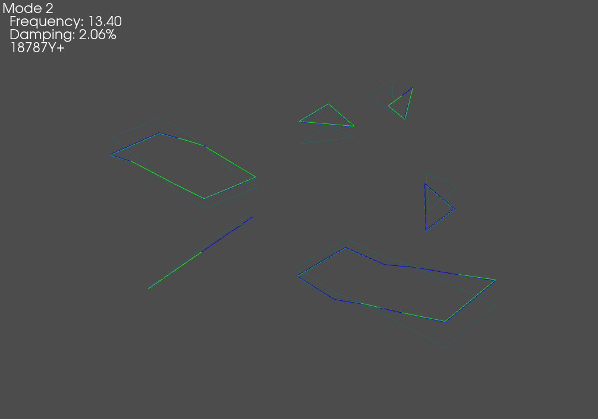
  
.. image:: figures/airplane_shape_overlay_fem.gif
  :width: 600
  :alt: Overlay of test and FEM shape on FEM
  
SEREP Expansion
---------------

Often times, the "stick" test geometry can be insufficient for communicating
results to test stakeholders, particularly when there are only uniaxial
sensors on the test.  Among other things, the System Equivalent Reduction
Expansion Process (SEREP) can be useful for expanding data at test sensors out
to the full finite element space for better visualization.  SDynPy makes it
easy to perform SEREP using the 
:py:func:`ShapeArray.expand<sdynpy.core.sdynpy_shape.ShapeArray.expand>` method.
Particularly in this case where we have kept the test geometry node IDs
equivalent to the original finite element node IDs, the expansion bookkeeping
is handled automatically.

We first need to create the set of shapes to use to expand the test shapes.
These will be the finite element shapes in the test bandwidth.  We then call
the :py:func:`ShapeArray.expand<sdynpy.core.sdynpy_shape.ShapeArray.expand>`
method, giving it the test geometry, finite element geometry, and expansion
basis shapes.  Note here that the global shapes and global geometry are used
in the expansion.  All coordinate transformations between the local test geometry
and global finite element geometry are handled automatically by SDynPy.

.. code-block:: python

    # Perform the expansion using the finite element shapes in the bandwidth
    expansion_basis = shapes_global[shapes_global.frequency < shape_bandwidth]
    expanded_shapes = test_shapes_polymax.expand(test_geometry,geometry_global,
                                                 expansion_basis)
    # We can then plot the expanded shapes on the original finite element geometry
    geometry_global.plot_shape(expanded_shapes,plot_options)
    
    # Or overlay the geometries and shapes
    expansion_comparison_geometry,expansion_comparison_shapes = sdpy.shape.overlay_shapes(
        (test_geometry,geometry_global),(test_shapes_polymax,expanded_shapes),[1,7])
    expansion_comparison_geometry.plot_shape(expansion_comparison_shapes,plot_options,
                                             deformed_opacity=0.5,undeformed_opacity=0)
                                             
.. image:: figures/airplane_serep_expansion.gif
  :width: 600
  :alt: Expanded test shapes on the shape on FEM
  
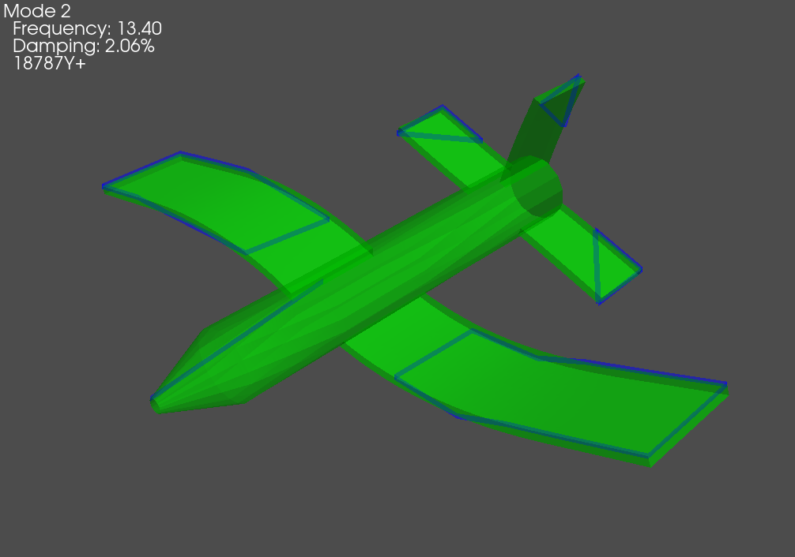
  
