Rattlesnake Demonstration
=========================

This page contains an example demonstrating some usages of SDynPy.  In this
analysis, we will load in Rattlesnake data, parse the dataset to get the data
we want, compute frequency response functions (FRFs), and fit modes to the data.
We will then load in an exodus file of the same structure used in the test and
compare test data against finite element data.

.. contents::

Imports
-------

For this project, we will import the following modules, including the SDynPy
module.

.. code-block:: python

    import numpy as np # Used for array manipulations
    import netCDF4 as nc4 # Used to load the data file 
    import matplotlib.pyplot as plt # Used to create figures
    plt.close('all') # Close all open matplotlib figures
    import pptx # Used to load in powerpoint files

    import sdynpy as sdpy
    
Load in Test Data
-----------------

The first thing we will do is load in the data.  We will do this using the
:py:func:`sdpy.rattlesnake.read_rattlesnake_output<sdynpy.fileio.sdynpy_rattlesnake.read_rattlesnake_output>`
function.  We could simply pass the file string to this function; however, we
would like to access other metadata inside the Rattlesnake output file as well,
so we load the dataset separately and then pass in a reference to the 
:py:func:`sdpy.rattlesnake.read_rattlesnake_output<sdynpy.fileio.sdynpy_rattlesnake.read_rattlesnake_output>`
function.

.. code-block:: python

    # Load in the specified file
    filename = r'rattlesnake_modal_data.nc4'
    # Load the netCDF4 dataset
    dataset = nc4.Dataset(filename)
    # Extract the time data and channel table from the test
    time_data, channel_table = sdpy.rattlesnake.read_rattlesnake_output(dataset)
    # Plot the time data so we can see where valid data is
    time_data.plot()
    # Make the figure look nice
    axis.set_xlabel('Time (s)')
    axis.set_ylabel('Data (various types)')
    axis.set_title('Rattlesnake Data')
    axis.figure.tight_layout()

The time data plot is shown here:

.. image:: figures/sdynpy_demo_time_data.png
  :width: 600
  :alt: Time data measured by Rattlesnake

At this point it is worth exploring the time_data object.  If we type :code:`time_data`
into the IPython console, we obtain some information about the data we've loaded.

.. code-block:: console

    In [1]: time_data
    Out[1]: TimeHistoryArray with shape 30 and 31745 elements per function
    
This tells us that there are 30 pieces of data in the test data we loaded which
correspond to the 30 channels in the test.  Each data array contains 31745
samples or time steps.

We can investigate what fields exist in the :code:`time_data` object by using the
:code:`time_data.fields` property.

.. code-block:: console

    In [2]:time_data.fields
    Out[2]: 
    ('abscissa',
     'ordinate',
     'comment1',
     'comment2',
     'comment3',
     'comment4',
     'comment5',
     'coordinate')

The abscissa, or independent variable (in this case, the time value at each
sample), is stored in the :code:`time_data.abscissa` field.  The ordinate, or
dependent variable (in this case, the value of acceleration or
force at each sample), is stored in the :code:`time_data.ordinate` field.
Because there are 30 pieces of data each with 31745 elements, the shape of the
:code:`abscissa` and :code:`ordinate` fields are 30 x 31745.

.. code-block:: console

    In [3]: time_data.abscissa.shape
    Out[3]: (30, 31745)

Another important field is the :code:`time_data.coordinate` field.  This stores
degree of freedom information in a
:py:class:`CoordinateArray<sdynpy.core.sdynpy_coordinate.CoordinateArray` object.

.. code-block:: console

    In [4]: time_data.coordinate
    Out[4]: 
    coordinate_array(string_array=
    array([['28376X+'],
           ['28376Y+'],
           ['28376Z+'],
           ['28560X+'],
           ['28560Y+'],
           ['28560Z+'],
           ['17290X+'],
           ['17290Y+'],
           ['17290Z+'],
           ['16733X+'],
           ['16733Y+'],
           ['16733Z+'],
           ['2467X+'],
           ['2467Y+'],
           ['2467Z+'],
           ['2392X+'],
           ['2392Y+'],
           ['2392Z+'],
           ['33715Y+'],
           ['36140Y+'],
           ['24046X-'],
           ['30947X-'],
           ['8579Y+'],
           ['12664Y+'],
           ['4475Z+'],
           ['2991Y+'],
           ['5457X-'],
           ['16733X+'],
           ['33715Y+'],
           ['28560Z+']], dtype='<U7'))

Computing FRFs
--------------

Note that there is a ramp up and down in the shaker data.  We don't want to
include these data in our analysis, so we will use the
:py:func:`extract_elements<sdynpy.core.sdynpy_data.NDDataArray.extract_elements>`
method of our :py:class:`time_data<sdynpy.core.sdynpy_data.TimeHistoryArray>`
object to reduce the abscissa.

.. code-block:: python

    # Use the plot to figure out the start and stop times of the signal we want to
    # analyze
    time_start = 1.0
    time_end = 14.0
    # Time data is stored in the abscissa attribute of the TimeHistoryArray object
    indices = ((time_data[0].abscissa >= time_start) 
               & (time_data[0].abscissa <= time_end))
    # Extract elements corresponding to the indices we want to keep
    truncated_time_data = time_data.extract_elements(indices)
    
In order to compute FRFs, we will need to separate the data into responses and
references.  In Rattlesnake, the responses were marked as control channels, so
we can parse the channel table to understand which channels were references and
which were responses.

.. code-block:: python

    # Separate into references and responses based on the control field of the
    # channel table
    response_indices = np.array(channel_table['control'].astype(bool))
    reference_indices = ~response_indices
    # Index the TimeHistoryArray object with the indices to pull out specific channels
    responses = truncated_time_data[response_indices]
    references = truncated_time_data[reference_indices]
    # Now plot to see that we've separated them correctly
    fig,ax = plt.subplots(2,1,sharex=True,num='Time Data')
    responses.plot(ax[0])
    ax[0].set_ylabel('Responses')
    references.plot(ax[1])
    ax[1].set_ylabel('References')
    ax[1].set_xlabel('Time (s)')

The plot is shown here:

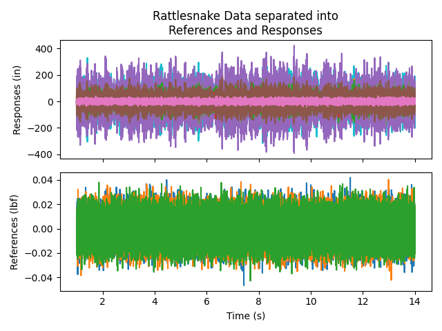
  
We can now finally compute FRFs using the static method
:py:func:`from_time_data<sdynpy.core.sdynpy_data.TransferFunctionArray.from_time_data>`.
This method is passed the reference and response
:py:class:`TimeHistoryArray<sdynpy.core.sdynpy_data.TimeHistoryArray>`
as well as various signal processing parameters that are extracted from the
metadata of the Rattlesnake output file.  We will remove the zero frequency
line and then plot the :code:`frfs` to make sure they look as expected.

.. code-block:: python

    # Compute FRFs from references, responses, and signal processing parameters
    # from Rattlesnake
    frfs = sdpy.TransferFunctionArray.from_time_data(
        references, responses,
        samples_per_average = dataset['Launch Random'].samples_per_frame,
        overlap = dataset['Launch Random'].overlap,
        window = dataset['Launch Random'].frf_window
        )
    # Remove the zero frequency line
    frfs = frfs.extract_elements(slice(1,None))
    # Plot the FRFs
    axes = frfs.plot()
    # Make the plots look nice
    axes[0].set_title('FRFs from Rattlesnake Data')
    axes[1].set_ylabel('Amplitude (in/lbf)')
    axes[1].set_xlabel('Frequency (Hz)')
    axes[0].figure.tight_layout()
    
The plot is shown here:

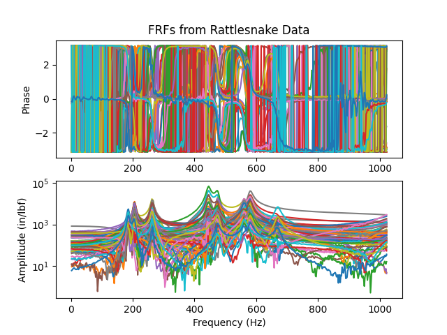

It can be difficult to visualize the plots on top of one another, and we really
don't want to plot 30 separate plots, so it can be useful to quickly iterate
through the curves to ensure they all look right.  This is handled well by the
:py:class:`sdpy.data.GUIPlot<sdynpy.core.sdynpy_data.GUIPlot>` class, which
allows a user to load in a number of functions and graphically select which to
plot.  By using the arrow keys, a user can quickly page through each plot.

.. code-block:: console

    In [5]: sdpy.data.GUIPlot(frfs)

.. image:: figures/sdynpy_demo_guiplot.png
  :width: 600
  :alt: FRFs from Rattlesnake Data.
  
It is again worth investigating the :code:`frfs` object to see what it contains.

.. code-block:: console

    In [6]: frfs
    Out[6]: TransferFunctionArray with shape 27 x 3 and 510 elements per function
    
This tells us that there are 27 x 3 functions in :code:`frfs` which
correspond to the 27 response channels and 3 references in the test.  Each FRF
contains 510 frequency lines.

We can investigate what fields exist in the :code:`frfs` object by using the
:code:`frfs.fields` property.  These will be identical to the :code:`time_data`
because they are both subclasses of :py:func:`NDDataArray<sdynpy.core.sdynpy_data.NDDataArray>`

.. code-block:: console

    In [7]: frfs.fields
    Out[7]: 
    ('abscissa',
     'ordinate',
     'comment1',
     'comment2',
     'comment3',
     'comment4',
     'comment5',
     'coordinate')

The abscissa, or independent variable (in this case, the frequency value at each
frequency line), is stored in the :code:`frfs.abscissa` field.  The ordinate, or
dependent variable (in this case, the value of the transfer function),
is stored in the :code:`frfs.ordinate` field.
Because there are 27 x 3 pieces of data each with 510 elements, the shape of the
:code:`abscissa` and :code:`ordinate` fields are 27 x 3 x 510.

.. code-block:: console

    In [8]: frfs.abscissa.shape
    Out[8]: (27, 3, 510)
    
The :code:`frfs.coordinate` field contains the degrees of freedom for each FRF.
However, now there is a reference coordinate and a response coordinate for each
function.  Looking at the shape of :code:`frfs.coordinate`, we see that there are
now two coordinate for each of the 27 x 3 functions, resulting in a final shape
of 27 x 3 x 2.  We can also access reference and response coordinates using the
helper propreties :code:`response_coordinate` and :code:`reference_coordinate`.
Here it should also be obvious that the response coordinates vary with the row
and the reference coordinates vary with the column of the FRF matrix.

.. code-block:: console

    In [9]: frfs.coordinate.shape
    Out[9]: (27, 3, 2)
    
    In [10]: frfs.response_coordinate
    Out[10]: 
    coordinate_array(string_array=
    array([['28376X+', '28376X+', '28376X+'],
           ['28376Y+', '28376Y+', '28376Y+'],
           ['28376Z+', '28376Z+', '28376Z+'],
           ['28560X+', '28560X+', '28560X+'],
           ['28560Y+', '28560Y+', '28560Y+'],
           ['28560Z+', '28560Z+', '28560Z+'],
           ['17290X+', '17290X+', '17290X+'],
           ['17290Y+', '17290Y+', '17290Y+'],
           ['17290Z+', '17290Z+', '17290Z+'],
           ['16733X+', '16733X+', '16733X+'],
           ['16733Y+', '16733Y+', '16733Y+'],
           ['16733Z+', '16733Z+', '16733Z+'],
           ['2467X+', '2467X+', '2467X+'],
           ['2467Y+', '2467Y+', '2467Y+'],
           ['2467Z+', '2467Z+', '2467Z+'],
           ['2392X+', '2392X+', '2392X+'],
           ['2392Y+', '2392Y+', '2392Y+'],
           ['2392Z+', '2392Z+', '2392Z+'],
           ['33715Y+', '33715Y+', '33715Y+'],
           ['36140Y+', '36140Y+', '36140Y+'],
           ['24046X-', '24046X-', '24046X-'],
           ['30947X-', '30947X-', '30947X-'],
           ['8579Y+', '8579Y+', '8579Y+'],
           ['12664Y+', '12664Y+', '12664Y+'],
           ['4475Z+', '4475Z+', '4475Z+'],
           ['2991Y+', '2991Y+', '2991Y+'],
           ['5457X-', '5457X-', '5457X-']], dtype='<U7'))
    
    In [11]: frfs.reference_coordinate
    Out[11]: 
    coordinate_array(string_array=
    array([['16733X+', '33715Y+', '28560Z+'],
           ['16733X+', '33715Y+', '28560Z+'],
           ['16733X+', '33715Y+', '28560Z+'],
           ['16733X+', '33715Y+', '28560Z+'],
           ['16733X+', '33715Y+', '28560Z+'],
           ['16733X+', '33715Y+', '28560Z+'],
           ['16733X+', '33715Y+', '28560Z+'],
           ['16733X+', '33715Y+', '28560Z+'],
           ['16733X+', '33715Y+', '28560Z+'],
           ['16733X+', '33715Y+', '28560Z+'],
           ['16733X+', '33715Y+', '28560Z+'],
           ['16733X+', '33715Y+', '28560Z+'],
           ['16733X+', '33715Y+', '28560Z+'],
           ['16733X+', '33715Y+', '28560Z+'],
           ['16733X+', '33715Y+', '28560Z+'],
           ['16733X+', '33715Y+', '28560Z+'],
           ['16733X+', '33715Y+', '28560Z+'],
           ['16733X+', '33715Y+', '28560Z+'],
           ['16733X+', '33715Y+', '28560Z+'],
           ['16733X+', '33715Y+', '28560Z+'],
           ['16733X+', '33715Y+', '28560Z+'],
           ['16733X+', '33715Y+', '28560Z+'],
           ['16733X+', '33715Y+', '28560Z+'],
           ['16733X+', '33715Y+', '28560Z+'],
           ['16733X+', '33715Y+', '28560Z+'],
           ['16733X+', '33715Y+', '28560Z+'],
           ['16733X+', '33715Y+', '28560Z+']], dtype='<U7'))
           
Creating a Test Geometry
------------------------

Now that we have our data, it would be useful to create our test geometry so
we can eventually visualize mode shapes.  For this, we will extract geometry
from a finite element model.  For this test, the nodes in the channel table were
named identically to the corresponding nodes in the finite element model, so 
we can use the node numbers to correlate degrees of freedom.

The finite element model in question is an Exodus file with an eigensolution
stored in its displacement data.  We will load that in, create a geometry from
the model data, and then plot it to make sure it looks right.

.. code-block:: python

    # Load in the exodus file into an Exodus object
    exo = sdpy.Exodus('exodus_eigensolution.exo')
    # Create a geometry from the full finite element model
    fem_geometry = sdpy.geometry.from_exodus(exo)
    # Now plot the geometry
    fem_geometry.plot(node_size=0,view_up=[0,1,0])

The plot of the finite element geometry is shown here:

.. image:: figures/sdynpy_demo_fem_geometry.png
  :width: 600
  :alt: Finite Element Model Geometry

Now we would like to reduce the finite element geometry down to our sensor
locations in the test.  We first visualize the reference and response coordinates
on the finite element model to make sure our bookkeeping is correct and they match
the test excitation locations.
    
.. code-block:: python
    
    # Now plot the coordinates from our test, note we can use numpy set operations
    # on CoordinateArrays
    response_coordinates = np.unique(frfs.response_coordinate)
    reference_coordinates = np.unique(frfs.reference_coordinate)
    # Plot the coordinates on the finite element geometry
    fem_geometry.plot_coordinate(response_coordinates,label_dofs=True,
                                 plot_kwargs={'node_size':0,'view_up':[0,1,0]})
    fem_geometry.plot_coordinate(reference_coordinates,label_dofs=True,
                                 plot_kwargs={'node_size':0,'view_up':[0,1,0]})

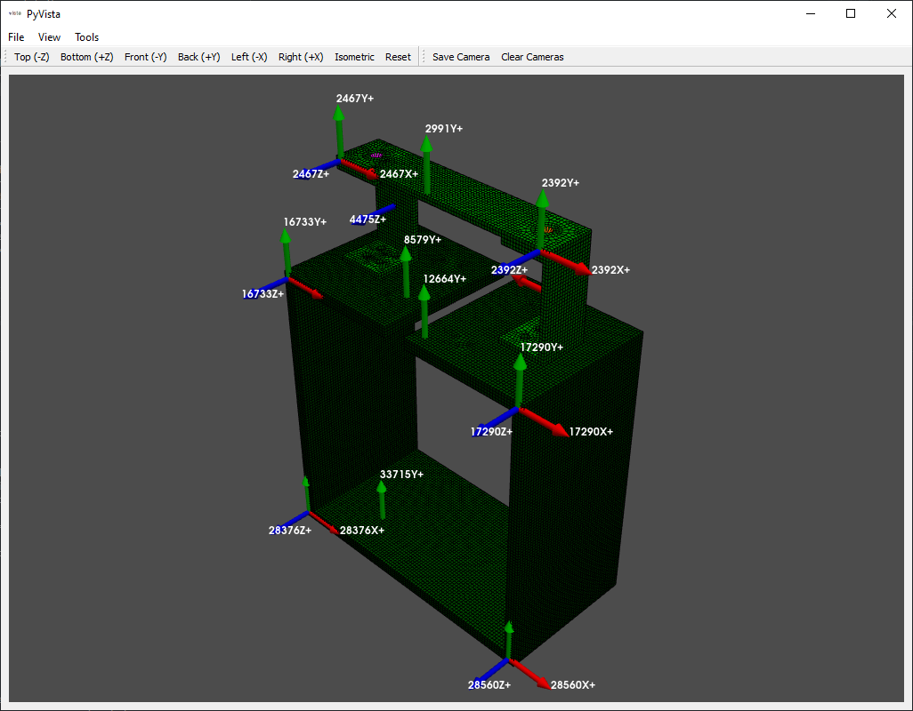
  
.. image:: figures/sdynpy_demo_reference_coordinates.png
  :width: 600
  :alt: Reference coordinates overlaid on the finite element model
  
Because there are common node numbers between test and analysis, we can easily
reduce down to only the nodes in our test using the :py:func:`reduce<sdynpy.core.sdynpy_geometry.Geometry.reduce>`
method, which accepts a list of nodes to keep.  Note that this will reduce the
geometry to only those nodes kept in the test, which will also destroy all elements
used to visualize the model.  Make sure when plotting this geometry, ensure that
the node size is not set to zero!

.. code-block:: python
    
    # Reduce down to only the nodes that are in our test
    keep_nodes = np.unique(frfs.coordinate.node)
    # Call the reduce function to reduce the geometry to just the kept nodes
    test_geometry = fem_geometry.reduce(keep_nodes)
    # Plot to make sure it looks right
    test_geometry.plot(view_up=[0,1,0])

At this point, it can be very difficult to visualize the model, as there are
only a handful of points.  We will add some tracelines to make visualization a
bit easier.  We can use the :py:func:`add_traceline<sdynpy.core.sdynpy_geometry.Geometry.add_traceline>`
method to quickly add a traceline to the model.  We can then plot it to see the
improvement.  We will also save it to a file so we can load it into our graphical
curve fitters.

.. code-block:: python
    
    # Now let's add some tracelines to aid in visualization.  We can pick the node
    # numbers from the plot of the response coordinates
    test_geometry.add_traceline([12664,17290,30947,28560,36140,33715,28376,24046,16733,8579],
                                description='box',color=11)
    test_geometry.add_traceline([4475,2467,2991,2392,5457],
                                description='rc')
    # Plot the test geometry now with tracelines
    test_geometry.plot(view_up=[0,1,0])
    # Save the test geometry to a file
    test_geometry.save('rattlesnake_test_geometry.npz')
    
Fitting Modes to the FRFs
-------------------------

Now that we have data and geometry, we can perform experimental modal analysis.
We will fit modes both with SMAC and PolyMax.  First we will do SMAC, so we can
call :py:class:`sdpy.SMAC_GUI<sdynpy.modal.sdynpy_smac.SMAC_GUI>` in the
IPython console to load the GUI.

.. code-block:: console

    In [12]: sdynpy.SMAC_GUI(frfs)
    Out[12]: <sdynpy.modal.sdynpy_smac.SMAC_GUI at 0x14fe6f05b80>
    
We then work through the SMAC GUI to fit shapes.  The first page selects the
mode type, the frequency range, and the data type.

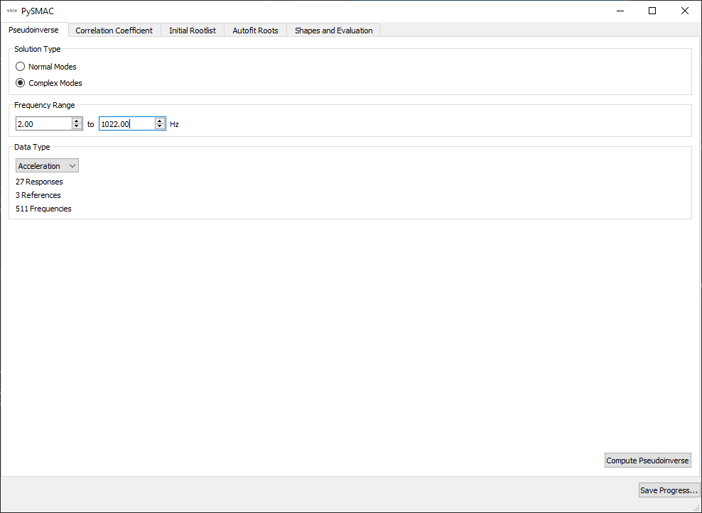
  
The second page selects initial guiesses for frequency and damping ratios for
use in computing the correlation coefficient.

.. image:: figures/sdynpy_demo_smac_corrcoef.png
  :width: 600
  :alt: Computing the iniial correlation in SMAC
  
The third page selects the initial roots that will be optimized by the solver.

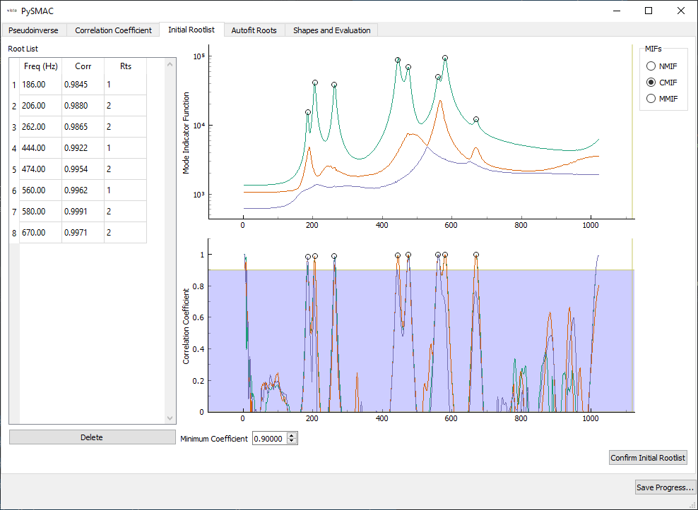
  
We then select optimizer parameters for SMAC's autofit.

.. image:: figures/sdynpy_demo_smac_autofit.png
  :width: 600
  :alt: Autofit parameters in SMAC.
  
Finally, we select the final shapes.  At this page we also resynthesize FRFs and
mode indicator functions, plot shapes and the Modal Assurance Criterion.

.. image:: figures/sdynpy_demo_smac_shape_and_eval.png
  :width: 600
  :alt: Autofit parameters in SMAC.
  
FRFs and CMIFs are visualized in the :py:class:`sdpy.data.GUIPlot<sdynpy.core.sdynpy_data.GUIPlot>`
GUI, so we can quickly switch between shapes and compare resynthesized to
experimental data.

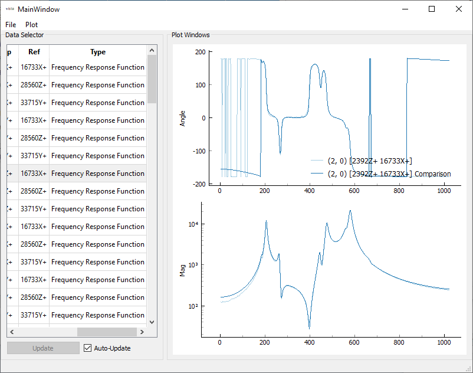
  
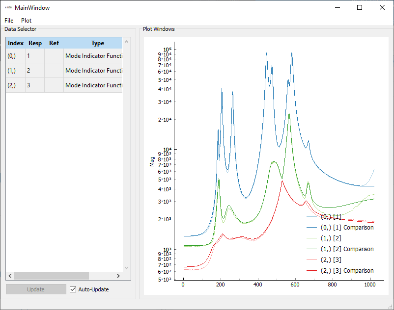
  
The MAC can also be plotted to visualize the independence of the shapes.

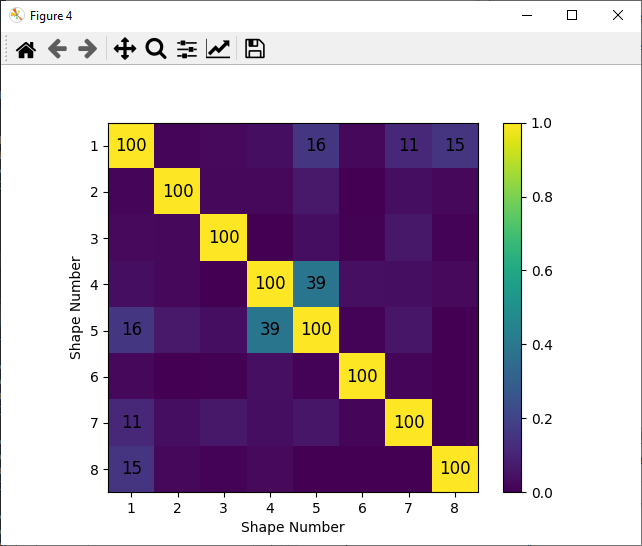
  
Shapes are saved to the file :code:`'rattlesnake_test_shapes_smac.npy'` so they
can be loaded into the script without re-running SMAC.

Similarly, PolyMax can be run by calling the :py:class:`sdpy.PolyMax_GUI<sdynpy.modal.sdynpy_polymax.PolyMax_GUI>`
class from the IPython console.

.. code-block:: console

    In [13]: sdynpy.PolyMax_GUI(frfs)
    Out[13]: <sdynpy.modal.sdynpy_polymax.PolyMax_GUI at 0x14fff4c5d30>
    
The first page of the SDynPy PolyMax implementation allows users to select the
frequency range of the analysis.  Also selected is the number of poles to use
in the polynomial fitter.

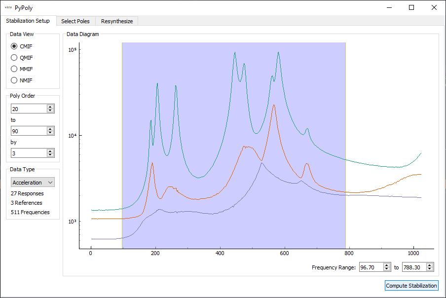
  
Once the poles are solved, a stability plot is presented.  The user can click
on individual icons on the stability plot to select given poles to use in the
resynthesis.

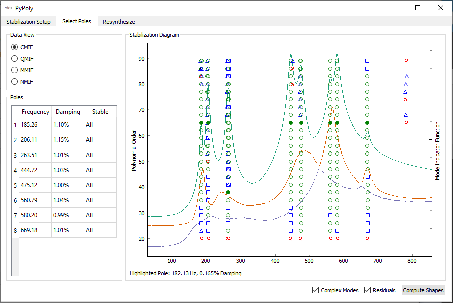
  
With the poles selected, shapes can be computed.  Resynthesized FRFs are plotted
for the user to investigate.

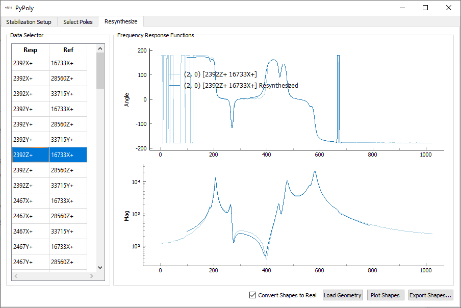
  
Shapes are saved to the file :code:`'rattlesnake_test_shapes_polymax.npy'` so they
can be loaded into the script without re-running PolyMax.

Analyzing Modal Parameters
--------------------------

At this point, we would like to analyze the modal parameters.  We will load the
shape files into our script for analysis using the
:py:func:`sdpy.shape.load<sdynpy.core.sdynpy_array.SdynpyArray.load>` method.

.. code-block:: python

    # Load the shape files from our curve fitting into the script
    test_shapes_smac = sdpy.shape.load('rattlesnake_test_shapes_smac.npy')
    test_shapes_polymax = sdpy.shape.load('rattlesnake_test_shapes_smac.npy')
    
We also want to extract finite element shapes from the Exodus file using the
:py:func:`sdpy.shape.from_exodus<sdynpy.core.sdynpy_shape.ShapeArray.from_exodus>`
method.

.. code-block:: python

    # Extract the finite element shapes
    fem_shapes = sdpy.shape.from_exodus(exo)
    # Only keep shapes below 2000 Hz for comparison
    fem_shapes = fem_shapes[fem_shapes.frequency < 2000]
    
In order to make meaningful comparisons between shapes, we need to reduce to a
common set of degrees of freedom.  This can be easily done in SDynPy by indexing
a :py:class:`sdpy.ShapeArray<sdynpy.core.sdynpy_shape.ShapeArray>` with a
:py:class:`sdpy.CoordinateArray<sdynpy.core.sdynpy_shape.CoordinateArray>`
containing the degrees of freedom to keep.  Note that the shape arrays are
returned in a number-of-modes x number-of-degrees-of-freedom array, which is 
transposed from the typical mode shape matrix, so we transpose the array
to orient it the typical way.  We can also use the shape matrices to create a
:py:class:`sdpy.ShapeArray<sdynpy.core.sdynpy_shape.ShapeArray>` object for the
finite element shapes reduced to the test degrees of freedom.

.. code-block:: python

    # Reduce the shapes to a common set of degrees of freedom to compare shapes
    # Extract the degrees of freedom from a test shape
    response_dofs = test_shapes_smac[0].coordinate
    # Can extract a shape matrix by indexing the shape arrays with a CoordinateArray
    test_shape_matrix_smac = test_shapes_smac[response_dofs].T
    test_shape_matrix_polymax = test_shapes_smac[response_dofs].T
    test_shape_matrix_fem = fem_shapes[response_dofs].T
    # Create an actual ShapeArray object
    fem_shapes_reduced = sdpy.shape_array(response_dofs,
                                          test_shape_matrix_fem.T,
                                          fem_shapes.frequency,fem_shapes.damping)
    
:py:mod:`sdpy.correlation<sdynpy.signal_processing.sdynpy_correlation>` contains
a number of functions that can be used to correlate data.  We will use
:py:func:`sdpy.correlation.mac<sdynpy.signal_processing.sdynpy_correlation.mac>`
to compute the Modal Assurance Criterion matrix.  The :py:mod:`sdpy.correlation<sdynpy.signal_processing.sdynpy_correlation>`
module also contains a :py:func:`sdpy.correlation.matrix_plot<sdynpy.signal_processing.sdynpy_correlation.matrix_plot>`
function that provides a nice visualization of the Modal Assurance Criterion matrix.

.. code-block:: python

    # Look at correlation between shapes from different tests/analyses
    mac_smac_polymax = sdpy.correlation.mac(test_shape_matrix_smac,test_shape_matrix_polymax)
    mac_smac_fem = sdpy.correlation.mac(test_shape_matrix_smac,test_shape_matrix_fem)
    mac_polymax_fem = sdpy.correlation.mac(test_shape_matrix_polymax,test_shape_matrix_fem)
    # Plot the mac matrix between the 
    sdpy.correlation.matrix_plot(mac_polymax_fem)

.. image:: figures/sdynpy_demo_mac_test_fem.png
  :width: 600
  :alt: MAC between test and FEM

Another way to compare shapes is to plot them on top of one another so the
differences are obvious.  We can use the Modal Assurance Matrix to figure out
the best matches between test and analysis.  Then we can use the 
:py:func:`sdpy.shape.overlay_shapes<sdpy.core.sdynpy_shape.ShapeArray.overlay_shapes>`
function to create both geometry and shapes that combine two geometries and 
shapes.  Using the optional :code:`color_override` argument allows setting a
different color to each geometry to aid in visualization.  We can then set up
the plotting arguments and plot the combined shapes.  We also save out an animation
of the first mode to a :code:`.gif` file.

.. code-block:: python

    # Compare shapes by overlaying them
    # Find the best match in the FEM to each of the test shapes
    fem_matches = np.argmax(mac_polymax_fem,axis=1)
    # Overlay the shapes and geometry
    combined_geometry,combined_shapes = sdpy.shape.overlay_shapes(
        (test_geometry,test_geometry),
        (test_shapes_polymax,fem_shapes_reduced[fem_matches]),
        color_override=[1,11])
    # Plot the shapes to set up the animation
    geometry_kwargs = {'view_up':[0,1,0],'line_width':5,'node_size':8}
    # Plot the shapes
    plotter = combined_geometry.plot_shape(combined_shapes, plot_kwargs=geometry_kwargs)
    # Save the initial mode showing as a .gif
    plotter.save_animation('mode_1.gif')

The overlaid shapes show good agreement between test and analysis.

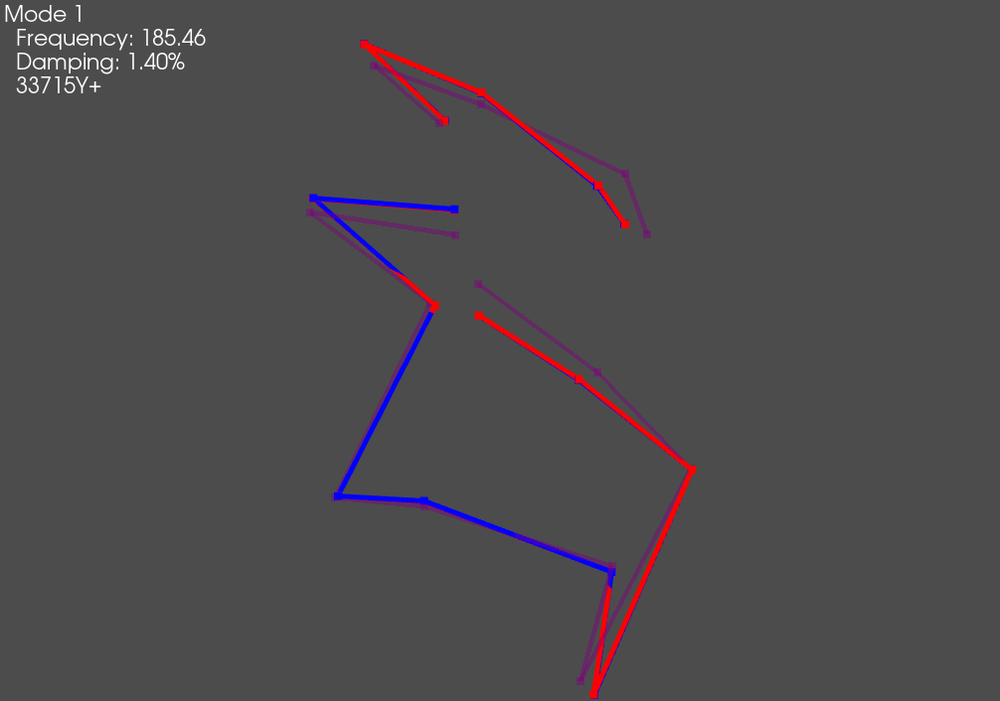

Documentation Generation
------------------------

While SDynPy is perfectly capable of generating and saving figures and animations
of mode shapes, it is often tedious to export the identical information for a
large number of modes.  Therefore SDynPy has the ability to export typical
documentation in either Powerpoint or LaTeX format.  This export will generally
not be enough to completely describe a given test, but it is easy enough to
take the exported data and add it to a completed report.

SDynPy can create a Powerpoint presentation using the 
:py:func:`sdpy.doc.create_summary_pptx<sdynpy.doc.sdynpy_ppt.create_summary_pptx>`
function.  This function can either take a filename to save the output presentation
as, or it can take an existing presentation object that it will add to.  This latter
approach is most useful for creeating a presentation with an existing template or
design.  If only a filename is specified, the output presentation will consist of
data over the default white slide backgrounds.  We will therefore load in a 
Powerpoint containing the Sandia corporate template to save us from having to
reformat the presentation into that template at a later time.

Note that different templates have different types of slides, so if using a custom
template, ensure that the :code:`title_slide_layout_index`, :code:`content_slide_layout_index`,
and :code:`empty_slide_layout_index` point to the proper layouts within the presentation.
Otherwise, errors may occur if, for example, SDynPy tries to access the subtitle on a
slide that does not have a subtitle placeholder on it.

.. code-block:: python
    
    # Open up a presentation with the Sandia theme
    prs = pptx.Presentation('C:/users/dprohe/documents/Powerpoint_Sandia_Theme.pptx')
    # Fill the presentation with our analysis data
    sdpy.doc.create_summary_pptx(prs,
                                  title='BARC Modal with Rattlesnake',
                                  subtitle='A SDynPy Demonstration',
                                  geometry = test_geometry,
                                  shapes = test_shapes_polymax,
                                  frfs=frfs,
                                  geometry_plot_kwargs = geometry_kwargs,
                                  content_slide_layout_index=2,
                                  empty_slide_layout_index=4)
    # Save the presentation out
    prs.save('rattlesnake_test_quicklook.pptx')
    
The output presentation is then formatted as specified and has the test
information automatically populated.  A geometry overview slide is presented,
as well as a modal slide.  Then there is one slide for each mode showing the
natural frequency, damping ratio, and animated shape.

.. image:: figures/sdynpy_demo_slide_title.png
  :width: 600
  :alt: Title slide of exported presentation
  
.. image:: figures/sdynpy_demo_slide_geometry.png
  :width: 600
  :alt: Slide containing geometry overview
  
.. image:: figures/sdynpy_demo_slide_mode_parameters.png
  :width: 600
  :alt: Overview slide of modal parameters
  
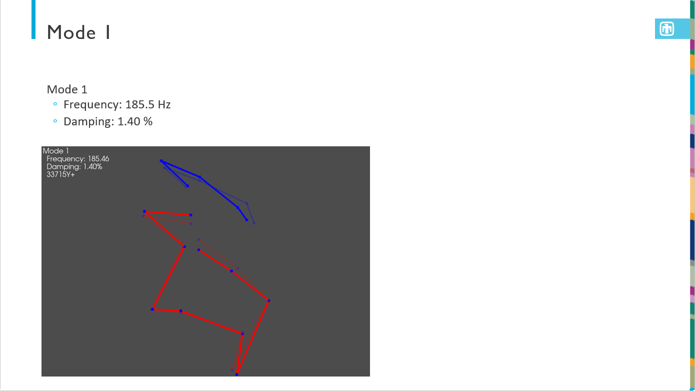
  
If a report document is required, SDynPy can also export LaTeX source code.
To remain as flexible as possible, SDynPy does not export a complete document,
as it cannot know which document class or template the data may be used in.
Instead, SDynPy outputs a portion of a LaTeX document that can be included in
a full document.  This is done using the 
:py:func:`sdpy.doc.create_latex_summary<sdynpy.doc.sdynpy_latex.create_latex_summary>`
function.  It is strongly suggested to set the :code:`figure_basename` argument
of that function to a subdirectory; a large number of figures will be generated
to allow animation of the shapes inside the exported PDF.

.. code-block:: python

    # Create a LaTeX snippet that can be included in a larger document
    sdpy.doc.create_latex_summary(
        figure_basename='figures/rattlesnake_test.png', 
        geometry = test_geometry, 
        shapes = test_shapes_polymax, 
        frfs = frfs,
        output_file = 'rattlesnake_test_memo_content.tex',
        geometry_plot_kwargs = geometry_kwargs)
        
This output LaTeX source code can be easily included in another document,
for example, this minimal Article class

.. code-block:: latex

    \documentclass[]{article}
    
    \usepackage{graphicx}
    \usepackage{animate}
    \usepackage{caption}
    \usepackage{subcaption}
    
    %opening
    \title{SDynPy Example LaTeX Documentation}
    \author{Dan Rohe}
    
    \begin{document}
    
    \maketitle
    
    \begin{abstract}
    
    \end{abstract}
    
    \section{SDynPy Content}
    
    \input{rattlesnake_test_memo_content.tex}
    
    \end{document}

produces the following PDF:

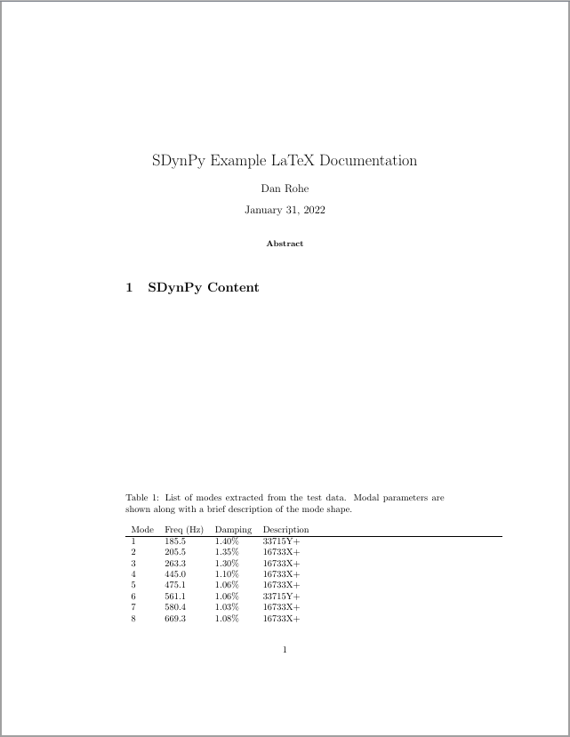
  
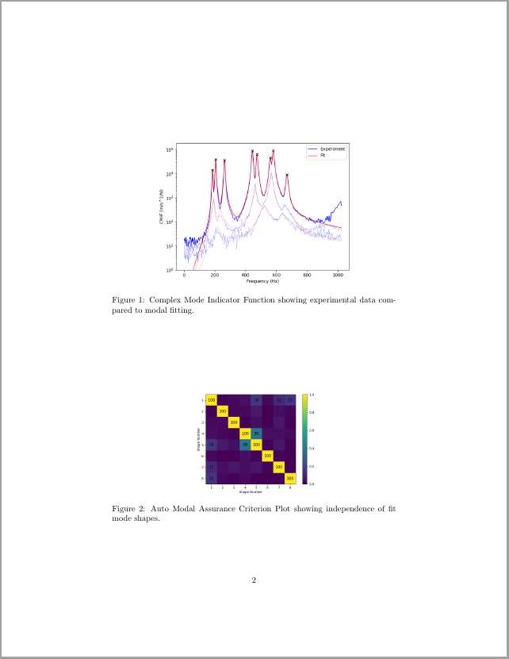
  
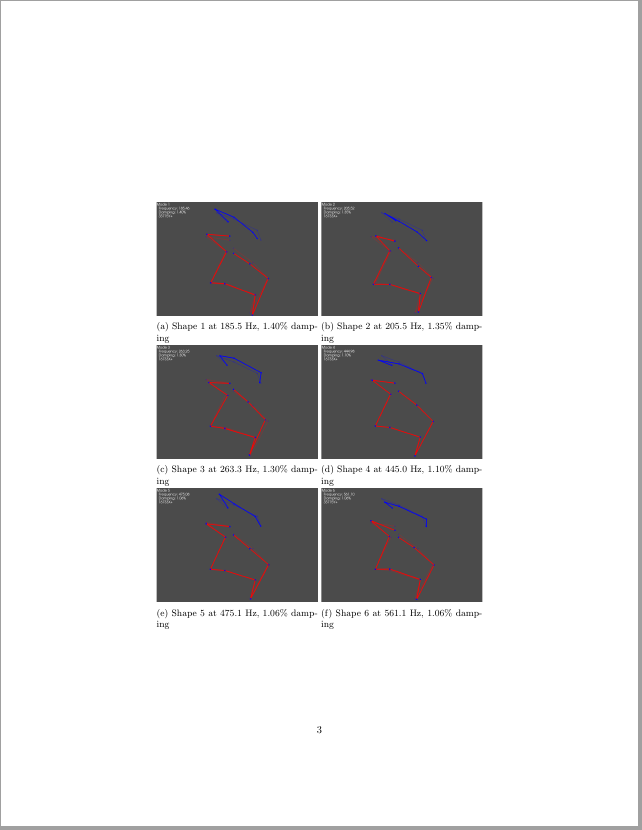

The user could obviously add context surrounding the exported content to describe
the test setup, etc.

Exporting to Exodus
-------------------

Finally, in order to share modal data with analysts who may be updating a model,
it is often useful to export data to their finite element format so the same
postprocessing tools can be used to visualize test and analysis results.  
We will therefore export our results to exodus format.  

It can be, however, difficult to gain an intuitive understanding about what is
happening in test shapes, particularly when some nodes have a limited number of
degrees of freedom (e.g. displacements from a uniaxial accelerometer).  Finite
element expansion techniques can be used to "fill in the gaps" of a test model
to make it easier to visualize the deformations of a given shape.

We will therefore perform SEREP expansion of the test data using the finite
element shapes as basis functions.  To do this, we solve for modal coefficients
that multiply the FEM shapes to produce the test shapes.  We can use the 
Modal Assurance Criterion matrix to help identify which finite element mode
shapes should be included in the expansion.

.. code-block:: python

    q = np.linalg.lstsq(test_shape_matrix_fem[:,:14],test_shape_matrix_polymax)[0]

We then want to multiply this coefficient by the full finite element shapes to
estimate what the test shapes would look like in the full finite element space.
While we could extract the full finite element shapes from the finite element
model, multiply them by the coefficients :code:`q`, and then rebuild the Exodus
file displacements, we can instead use the
:py:func:`sdpy.ExodusInMemory.repack<sdynpy.fem.sdynpy_exodus.ExodusInMemory.repack>`
method, which is designed to produce new Exodus results that are a linear
combination of old Exodus results.  We will first load our 
:py:class:`sdpy.Exodus<sdynpy.fem.sdynpy_exodus.Exodus>` object into
memory to obtain an :py:class:`sdpy.ExodusInMemory<sdynpy.fem.sdynpy_exodus.ExodusInMemory>`
object.  Note that we need to ensure that we load in the same time steps that
were used in the expansion to make sure all matrices are properly sized.  
:py:func:`sdpy.ExodusInMemory.repack<sdynpy.fem.sdynpy_exodus.ExodusInMemory.repack>`
makes no assumptions what the time steps in the model should be, so it is up to
us to fill that information in with the test frequencies.

.. code-block:: python

    # Load the Exodus object into memory
    fexo = exo.load_into_memory(variables=['DispX','DispY','DispZ'],timesteps=np.arange(14),
                            blocks=[1,2])
    # Linearly combine the existing shapes into new shapes
    fexo_repack = fexo.repack(q)
    # Fill in the abscissa data (frequencies in this case)
    fexo_repack.time = test_shapes_polymax.frequency
    
If we want to plot the new shapes in SDynPy, we could load the shapes back into
a :py:class:`sdpy.ShapeArray<sdynpy.core.sdynpy_shape.ShapeArray>` object, and
even combine with the finite element shapes for comparison.

.. code-block:: python

    # Plot expanded shapes against finite element shapes
    # Load shapes into sdynpy ShapeArray object
    expanded_shapes_polymax = sdpy.shape.from_exodus(fexo_repack)
    # combine the shapes
    combined_expanded_geometry,combined_expanded_shapes = sdpy.shape.overlay_shapes(
        (fem_geometry,fem_geometry),
        (expanded_shapes_polymax,fem_shapes[fem_matches]),color_override=[1,11])
    # Plot the shapes overlaid
    plotter = combined_expanded_geometry.plot_shape(
        combined_expanded_shapes,{'view_up':[0,1,0],'node_size':0},
        deformed_opacity=0.5,undeformed_opacity=0)
    plotter.save_animation('expanded_mode_1.gif')

.. image:: figures/sdynpy_demo_expanded_mode_1.gif
  :width: 600
  :alt: Comparison of expanded mode shape 1 against finite element shape 1
  
We can also write out both the test data and expanded data to Exodus files
to visualize in external software.

.. code-block:: python

    # Create an ExodusInMemory object from sdynpy objects
    fexo_out = sdpy.ExodusInMemory.from_sdynpy(test_geometry,test_shapes_polymax)
    # Write it to a file
    fexo_out.write_to_file('rattlesnake_test_output.exo',clobber=True)
    # Repeat with the expanded data
    fexo_out = sdpy.ExodusInMemory.from_sdynpy(fem_geometry,expanded_shapes_polymax)
    fexo_out.write_to_file('rattlesnake_test_output_expanded.exo',clobber=True)

The Exodus files can then be loaded into an external software such as Paraview
for visualization, which provides more flexibility than exists in SDynPy.

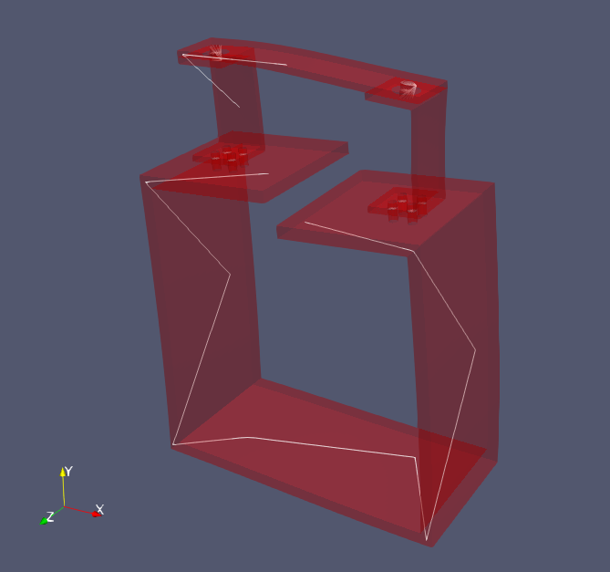
